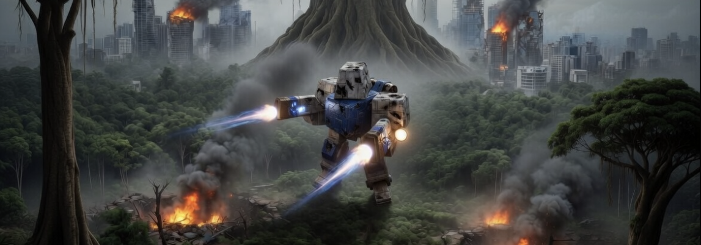

# KBot - Total Annihilation Toolkit



[](https://pkg.go.dev/github.com/coreprime/kbot)
[](https://opensource.org/licenses/MIT)
[](https://github.com/coreprime/kbot/issues)
[](https://github.com/coreprime/kbot/commits/main)

A toolkit for working with Total Annihilation game assets. KBot provides a unified CLI for managing the various proprietary file formats used by the game, along with a web-based asset explorer. There are also development tools, allowing advanced debugging and processing of various formats, including the COB/BOS scripting language.

## Installation

```bash
go install github.com/coreprime/kbot/cmd/kbot@latest
```

Or build from source:

```bash
git clone https://github.com/coreprime/kbot.git
cd kbot
task build        # builds the web UI and kbot binary
task install      # installs kbot to $GOPATH/bin
```

## Getting Started
To run the visual explorer for Total Annihilation:

- Perform the installation steps
- Run the web explorer with `kbot mount ~/games/totala --server`

To develop/code against the project:

- Create a flattened version of your Total Annihilation gmae assets with `kbot mount flatten  ~/games/totala ~/games/totala-flattened`
- Clone `.env` to `.env.local` and set your paths
- `task build` / `task lint` will run the code quality checks.

## Table of Contents

- [Installation](#installation)
- [File-Format Reference](docs/formats/README.md) — deep dive into HPI, GAF,
  PCX, PAL, FNT, SCT, TNT, 3DO, COB/BOS, TDF/FBI/OTA, TA:K GUI
- [Commands](#commands)
  - [`kbot ctx` — Working-Directory Contexts](#kbot-ctx--working-directory-contexts)
  - [`kbot cob` — COB/BOS Scripting](#kbot-cob--cobbos-scripting)
  - [`kbot hpi` — Archive Files](#kbot-hpi--archive-files)
  - [`kbot gaf` — Sprite Animations](#kbot-gaf--sprite-animations)
  - [`kbot pcx` — PCX Images](#kbot-pcx--pcx-images)
  - [`kbot fnt` — Bitmap Fonts](#kbot-fnt--bitmap-fonts)
  - [`kbot sct` — Map Sections](#kbot-sct--map-sections)
  - [`kbot pal` — Palettes & Lookup Tables](#kbot-pal--palettes--lookup-tables)
  - [`kbot tnt` — TNT Maps](#kbot-tnt--tnt-maps)
  - [`kbot zrb` — Smacker Video](#kbot-zrb--smacker-video)
  - [`kbot mount` — Asset Explorer](#kbot-mount--asset-explorer)
  - [`kbot studio` — KBot Studio (Map Editor)](#kbot-studio--kbot-studio-map-editor)
  - [`kbot document` — Reference Catalogue Generator](#kbot-document--reference-catalogue-generator)
  - [`kbot mcp` — Model Context Protocol Server](#kbot-mcp--model-context-protocol-server)
- [Shell Completion](#shell-completion)
- [Project Structure](#project-structure)
- [Development](#development)
  - [Game Asset Setup](#game-asset-setup)
- [License](#license)


## Commands

### `kbot ctx` — Working-Directory Contexts

Register named Total Annihilation installs (packed or flattened) so the other
kbot subcommands that rely on a virtual filesystem can pick them up
automatically — no more typing `--vfs ~/games/totala` on every command.

Contexts persist to `~/.kbot` (a small JSON file, conceptually equivalent to
`~/.kube/config`). One context is marked *current* at any time; the
`KBOT_CONTEXT` environment variable overrides the persisted current for the
running process so you can flip between installs per-shell without editing the
file.

```bash
# Register a packed TA install and mark it current
kbot ctx add ~/games/totala --alias ta-gog --game totala --version 3.1c

# Register a TA: Kingdoms install alongside
kbot ctx add ~/games/tak --alias kingdoms --game takingdoms

# Register a flattened directory you keep for development
kbot ctx add ~/ta-flattened --alias ta-flat --game totala --version 3.1c-flat

# Adopt the current directory.  If it's already registered, just switch
# to it; otherwise launch a small interactive prompt for alias, game,
# and version.
cd ~/games/totala
kbot ctx here

# Show every registered context (the current one is starred).
# `kbot ctx` with no subcommand does the same; use `kbot ctx --help`
# for the full help text.
kbot ctx
kbot ctx list

# Print the active context's path — handy in shell substitution
cd "$(kbot ctx path)"
ls "$(kbot ctx path)/units"

# Print a specific context's path without switching to it
kbot ctx path --alias kingdoms

# Switch the persisted current context
kbot ctx use kingdoms

# Per-shell override (does not touch ~/.kbot)
KBOT_CONTEXT=ta-flat kbot tnt preview "metal heck.tnt" --target preview.png

# Replace an existing entry (e.g. you moved the game folder)
kbot ctx add ~/new/totala --alias ta-gog --game totala --version 3.1c --replace

# Remove a context
kbot ctx delete kingdoms
```

**`--game`** must be one of `totala`, `takingdoms`, or `custom`. `custom` is the
escape hatch for directories that look like a TA layout but aren't an official
release (mod test-beds, partial extractions, etc.).

**Where contexts apply.** Any subcommand that mounts a VFS will fall back to
the active context when its path argument is omitted:

| Command | Without an arg/flag |
|---------|--------------------|
| `kbot mount` | Mounts the active context. |
| `kbot mount flatten --target …` | Flattens the active context. |
| `kbot tnt preview <file.tnt>` | Uses the active context as the VFS root for sprites and the sister `.ota`. |
| `kbot mcp` | Registers the active context as the default `game-data` folder. |
| `kbot cob lint` | Lints the active context's tree when no path is passed. |
| `kbot cob roundtrip` | Scans the active context's tree when no path is passed. |
| `kbot gaf roundtrip` | Scans the active context's tree when no path is passed. |

Explicit arguments (a positional path, `--vfs`, or `--game-data`) always
override the context.  Use `KBOT_CONTEXT=<alias>` to pick a different
registered context just for one invocation.

The file format is plain JSON, so you can hand-edit it if you need to:

```json
{
  "current": "ta-gog",
  "contexts": {
    "ta-gog":    { "path": "/Users/me/games/totala", "game": "totala",     "version": "3.1c" },
    "kingdoms":  { "path": "/Users/me/games/tak",    "game": "takingdoms" },
    "ta-flat":   { "path": "/Users/me/ta-flattened", "game": "totala",     "version": "3.1c-flat" }
  }
}
```

---

### `kbot cob` — COB/BOS Scripting

Work with compiled unit scripts (COB bytecode) and their BOS source.

```bash
# Decompile COB to BOS source
kbot cob decompile unit.cob
kbot cob decompile unit.cob --target unit.bos

# Compile BOS source to COB
kbot cob compile unit.bos --target unit.cob

# Disassemble COB to assembly listing
kbot cob disassemble unit.cob
kbot cob disassemble unit.cob -a          # annotated with flow arrows
kbot cob disassemble unit.cob -s Create   # single script

# Assemble back to COB
kbot cob assemble unit.coba --target unit.cob

# Lint for common issues
kbot cob lint unit.cob
kbot cob lint scripts/                     # lint a whole directory
kbot cob lint scripts/ -q                  # summary only
kbot cob lint scripts/ --ci > cob.sarif    # SARIF 2.1.0 for CI ingest

# Roundtrip validation (byte-perfect decompile→compile and disassemble→assemble)
kbot cob roundtrip scripts/
kbot cob roundtrip scripts/ --detailed
```

All commands support `--stream` to read from stdin and `--target` to write to a file (default: stdout).

**Lint rules:**

| Rule | Severity | Description |
|------|----------|-------------|
| `unused-piece` | ⚠️ warning | Piece declared but never used |
| `unused-static` | ⚠️ warning | Global variable never accessed |
| `unused-local` | ⚠️ warning | Local variable allocated but unused |
| `always-true` | ℹ️ info | `if(1)` / `while(1)` — always-true condition |
| `dead-code` | ⚠️ warning | `if(0)` / `while(0)` — unreachable code |
| `long-function` | ⚠️ warning | Function exceeds 100 instructions |
| `high-complexity` | ⚠️ warning | Cyclomatic complexity > 15 |
| `invalid-call` | ❌ error | call-script to non-existent function |
| `speed-zero` | ⚠️ warning | `move`/`turn` with `speed <0>` — never completes |
| `empty-function` | ℹ️ info | Function body is only `return 0` |
| `duplicate-animation` | ⚠️ warning | Identical sequential animation command |
| `sleep-only-guard` | ℹ️ info | `if` block contains only a `sleep` |
| `duplicate-if` | ℹ️ info | Back-to-back identical `if` conditions |
| `raw-signal` | ℹ️ info | Signal uses raw number (BOS only) |
| `unnamed-global` | ℹ️ info | Static var uses `global_N` naming (BOS only) |
| `signal-never-signalled` | ⚠️ warning | `set-signal-mask` watches a signal nobody sends |
| `recursive-call` | ⚠️ warning | `call-script` forms a cycle |

---

### `kbot hpi` — Archive Files

Manage HPI, UFO, and CCX archive files.

```bash
# List archive contents
kbot hpi list archive.hpi
kbot hpi list archive.hpi -v               # verbose (sizes, compression)
kbot hpi list archive.hpi -p "*.wav"       # filter by pattern

# Extract files
kbot hpi extract archive.hpi
kbot hpi extract archive.hpi -t ./output   # target directory
kbot hpi extract archive.hpi -p "sounds/*" # extract matching files

# Pack a directory into an archive
kbot hpi pack ./content --target archive.hpi

# Show archive details
kbot hpi info archive.hpi
```

All read commands support `--stream` to read the archive from stdin.

---

### `kbot gaf` — Sprite Animations

Work with GAF animation files containing sprite sequences.

```bash
# List sequences
kbot gaf list sprites.gaf

# Export a sequence as GIF or PNG
kbot gaf export sprites.gaf --format gif
kbot gaf export sprites.gaf --format png --sequence 3

# Dump all sequences and frames to a folder
kbot gaf dump sprites.gaf --target ./sprites --format png

# Build a GAF from a dump folder
kbot gaf build ./sprites --target rebuilt.gaf
```

The dump output includes a `frames.csv` in each sequence folder with timing metadata. The build command reads this CSV to reconstruct frame durations.

---

### `kbot pcx` — PCX Images

Inspect and convert PCX image files.

```bash
# Describe a PCX file (detailed metadata)
kbot pcx describe image.pcx

# Convert to PNG, GIF, or BMP
kbot pcx convert image.pcx --format png
kbot pcx convert image.pcx --format png --target output.png

# One-line info summary
kbot pcx info image.pcx
```

---

### `kbot fnt` — Bitmap Fonts

Inspect and render Total Annihilation 1-bpp bitmap fonts.  Each `.fnt` file
holds up to 256 glyphs sharing a single height; widths vary per glyph.

```bash
# One-line summary
kbot fnt info comix.fnt

# Detailed metadata (height, flags, glyph count, code-point coverage)
kbot fnt describe comix.fnt
kbot fnt describe comix.fnt --list      # also enumerate every defined glyph

# Render a string to PNG
kbot fnt render comix.fnt --text "Hello TA" --target hello.png
kbot fnt render armfont.fnt --text "Commander" --fg "#ffff00" --bg transparent

# Render every defined glyph as a 16-column sprite sheet
kbot fnt sheet comix.fnt --target sheet.png

# Dump one PNG per glyph (named U+00XX.png) into a directory
kbot fnt dump comix.fnt --target ./glyphs
```

Colors accept `#rrggbb`, `#rrggbbaa`, or the literal `transparent` / `none`.

---

### `kbot sct` — Map Sections

Inspect and render Total Annihilation `.SCT` map sections — the reusable tile
blocks the official map editor stitches together to build `.TNT` maps.

```bash
# One-line summary
kbot sct info hill01.sct

# Detailed metadata (header, tile/attr counts, height stats)
kbot sct describe hill01.sct

# Render the full tile grid (32 px per tile) to PNG
kbot sct image hill01.sct --target hill01.png

# Export the elevation grid (16 px resolution) as a normalised grayscale PNG
kbot sct heightmap hill01.sct --target hill01-h.png

# Export the embedded 128x128 minimap as PNG
kbot sct minimap hill01.sct --target hill01-mini.png
```

---

### `kbot pal` — Palettes & Lookup Tables

Inspect and convert Total Annihilation `.PAL` palettes, plus the related
1024-byte `.ALP` / `.LHT` / `.SHD` 256×4 color-index lookup tables used for
shadow blending and light levels.

```bash
# One-line summary (size, unique colors, duplicates, TA-style flag)
kbot pal info palette.pal

# Every entry with hex + RGB
kbot pal describe palette.pal

# 16x16 PNG swatch grid (index 0 hatched with magenta to highlight the
# transparent sentinel)
kbot pal swatch palette.pal --target palette.png --cell 16

# Convert to editor-friendly formats
kbot pal convert palette.pal --target palette.gpl              # GIMP Palette
kbot pal convert palette.pal --target palette.txt --format jasc  # JASC-PAL text
kbot pal convert palette.pal --target re-emitted.pal --format pal  # binary TA .PAL

# Render an .ALP/.LHT/.SHD lookup table as a 256x4 PNG using the embedded
# palette (or pass --palette to use a specific one)
kbot pal lookup palette.alp --target alp.png
kbot pal lookup palette.lht --palette palette.pal --target lht.png
```

---

### `kbot tnt` — TNT Maps

Inspect, render, unpack and pack Total Annihilation `.TNT` map terrain.

```bash
# Summary on the console
kbot tnt describe "metal heck.tnt"

# Render artefacts
kbot tnt image     "metal heck.tnt" --target map.png         # full RGBA map (1:1, 32 px / tile)
kbot tnt heightmap "metal heck.tnt" --target height.png      # 8-bit grayscale (16 px / cell)
kbot tnt buildmap  "metal heck.tnt" --target build.png       # per-cell buildability classification
kbot tnt voidmap   "metal heck.tnt" --target voids.png       # engine-void mask (Feature == 0xFFFC only)
kbot tnt minimap   "metal heck.tnt" --target mini.png        # embedded minimap

# Same as `image`, but composite feature sprites and draw numbered StartPos
# markers from the sister .ota.  --vfs points at a flattened TA install (or
# any directory containing features/*.tdf and anims/*.gaf).
kbot tnt preview "metal heck.tnt" --vfs ~/ta-flattened --target preview.png

# Pick a different schema's StartPos set (0-based; default 0).
kbot tnt preview "metal heck.tnt" --schema 2 --target preview-s2.png

# --vfs may be omitted when a kbot context is active (see `kbot ctx`)
kbot tnt preview "metal heck.tnt" --target preview.png

# Tiny ASCII rendering (dev-joke / quick sanity check)
kbot tnt ascii "metal heck.tnt" --cols 64

# Decompose into editable files
kbot tnt unpack "metal heck.tnt" --target ./metal_heck

# Preserve the original feature table verbatim so the unpack/pack round-trip
# is byte-identical (default unpack drops trailing scratch bytes Cavedog's
# tooling left in feature-name buffers; pack rebuilds the table from the
# unique names referenced in features.csv).
kbot tnt unpack "metal heck.tnt" --target ./metal_heck --lossless

# Reverse the unpack
kbot tnt pack ./metal_heck --target metal_heck.tnt
```

**Unpack layout (`--target <dir>`):**

```
<dir>/
  map.png            full RGBA render of the tile grid
  heightmap.png      8-bit grayscale, pixel = raw elevation byte
  minimap.png        paletted PNG of the embedded minimap
  tiles/<n>.png      paletted 32×32 PNG per unique tile
  tilemap.csv        2D grid of tile indices (rows = y, cols = x)
  features.csv       feature_index,name,attr_x,attr_y per placement
  metadata.json      header constants + round-trip info (feature table when --lossless)
```

`heightmap.png` is unnormalised so the pixel value equals the raw elevation byte — round-trip safe. Pass `--normalize` to stretch the range for human viewing. `minimap.png` is paletted so palette indices survive the round-trip.

`kbot tnt unpack` is lossy by default: the feature name table is omitted from `metadata.json` and `kbot tnt pack` rebuilds it from the unique names in `features.csv`. This loses any trailing scratch bytes the original tooling left in the table. Pass `--lossless` to record the original feature table (and the raw feature bytes as `feature_raw_b64`) in `metadata.json` so the directory packs back to a byte-identical TNT.

**Buildmap classification (`kbot tnt buildmap`):**

The PNG is at attribute-cell resolution (one pixel per 16×16 cell, same as `heightmap`).  Each cell is classified, in priority order:

| Colour | Meaning |
|---|---|
| Black  | engine-void — `TileAttr.Feature == 0xFFFC` |
| Red    | a feature is placed in the cell (rocks, trees, geo-vents, ...) |
| Blue   | underwater — `Height` is below sea level |
| Yellow | cliff edge — `\|Δheight\|` to a 4-neighbour exceeds 32 game units |
| Green  | buildable |

By default the .tnt header's `SeaLevel` field drives the underwater check; pass `--sealevel <n>` to override (0 disables the check).  `0xFFFD` / `0xFFFE` are **not** classified as void — see [docs/formats/tnt.md](docs/formats/tnt.md) for the rationale (Metal Heck and a few other early Cavedog maps mark steam vents this way, and those cells are demonstrably buildable in-engine).

**Voidmap (`kbot tnt voidmap`):**

A transparent PNG at attribute-cell resolution.  Cells with `Feature == 0xFFFC` are opaque red; everything else is transparent — overlay it on a `kbot tnt image` render to highlight just the engine-void areas.

> The Studio's **Advanced › Export** menu offers the same artefacts plus the minimap and the active-schema preview:
>
> | Menu item | Backend | CLI / MCP equivalent |
> |---|---|---|
> | Export Minimap | client canvas snapshot | (n/a) |
> | Export Full Render | `tnt.RenderTileMap` + `tntpreview.ComposeWith` (active schema's StartPos markers) | `kbot tnt preview --schema <ActiveSchema>` / `tnt_preview` |
> | Export Map Image | `tnt.RenderTileMap` (bare tile grid, no overlays) | `kbot tnt image` / `tnt_image` |
> | Export Buildmap | `tnt.RenderBuildMap` | `kbot tnt buildmap` / `tnt_buildmap` |
> | Export Voidmap | `tnt.RenderVoidMap` | `kbot tnt voidmap` / `tnt_voidmap` |

**Linting a map:**

`kbot tnt lint` runs the same checks Studio's Quality Checker dialog
applies, plus the tile-pool diagnostics that `kbot tnt optimize` is
built on.  No files are modified — the command is read-only and
returns exit-1 when any issue is reported (handy for CI).

By default the command mounts the **active kbot context** (`kbot
ctx`) as a virtual filesystem, so the `path` argument can be a bare
basename, a virtual path inside an HPI / GP3 archive, or an absolute
disk path.  The sibling `.ota` and the metal-proximity feature
registry are picked up from the same VFS automatically.

```bash
# Bare basename — searched against maps/ in the active context VFS.
kbot tnt lint "metal heck.tnt"

# Virtual path — addresses a file inside an HPI archive directly.
kbot tnt lint "maps/the pass.tnt"

# Local file on disk (absolute or relative to cwd) still works.
kbot tnt lint ./my-edit.tnt

# Override the mount root for one invocation.
kbot tnt lint --vfs ~/ta-flattened "metal heck.tnt"

# Skip the quality pass; just report tile-pool savings.
kbot tnt lint --no-quality "metal heck.tnt"

# Override the sister .ota lookup (also accepts virtual paths).
kbot tnt lint --ota ./my-edit.ota "metal heck.tnt"

# Emit SARIF 2.1.0 on stdout for CI ingest (GitHub, GitLab, Harness…).
kbot tnt lint --ci "metal heck.tnt" > tnt-lint.sarif
```

Relative paths like `./maps/Metal Heck.tnt` are resolved against the
mounted VFS (lowercased and `./` stripped); any `..` segment is
rejected so a path argument can't escape the kbot workspace.

Checks (each emits a row, ✅ / ⚠️ / ❌ icon, one-line summary):

| Group | Rule | Catches |
|---|---|---|
| Tile pool | `duplicate-tiles` | Byte-identical tile graphics |
| Tile pool | `similar-tiles` | Visually-similar graphics sharing a heightmap footprint (configurable via `--similarity`) |
| Tile pool | `unused-tiles` | Tile graphics no cell references |
| Quality | `dedupTiles` | Same as `duplicate-tiles`, surfaced via the Studio quality dialog id |
| Quality | `otaFields` | Lobby-required OTA metadata missing |
| Quality | `startsInBounds` | Start positions outside the map or sitting on a void cell |
| Quality | `schemaSlots` | An advertised `numplayers` count no schema can host (insufficient StartPos entries) |
| Quality | `metalProximity` | Start without a metal-producing feature within 24 tiles (skipped on metal-rich schemas) |
| Quality | `voidIslands` | Passable cells unreachable from any start (≥ 20 cells) |
| Quality | `heightDiscontinuities` | Cliffs > 32 height units between adjacent cells — likely to block ground pathing |

The shared implementation lives in [`internal/maplint`](internal/maplint) so the CLI, the studio dialog, and the MCP tool all run identical logic against identical thresholds.  The MCP tool name is `tnt_lint` and accepts `path`, `ota_path` (optional), `similarity` (optional, defaults to 1.0), `quality` (optional, defaults to true), and `game_data` (optional, picks the VFS used for the metal-proximity check).

---

### `kbot zrb` — Smacker Video

Work with Smacker (.smk/.zrb) video files.

```bash
# Show video information
kbot zrb info video.smk

# Convert to MP4
kbot zrb to-mp4 video.smk --target video.mp4

# Convert from MP4
kbot zrb from-mp4 video.mp4 --target video.smk
```

Requires FFmpeg for conversions.

---

### `kbot mount` — Asset Explorer

Browse game files interactively in a terminal or web UI.

```bash
# Terminal browser
kbot mount ~/ta-content

# Web server (KBot Explorer)
kbot mount ~/ta-content --server
kbot mount ~/ta-content --server --port 8080

# Flatten (extract all files to disk)
kbot mount ~/ta-content flatten --target ./flat

# Omit the path to mount the active kbot context (see `kbot ctx`)
kbot mount --server
kbot mount flatten --target ./flat
```

**Terminal commands:** `ls`, `cd`, `pwd`, `cat`, `describe`, `archives`, `stats`, `exit`

**Web UI features:**
- Browse files with icon/list view and search
- View COB scripts with syntax highlighting, code folding, and linting
- View GAF animations with APNG preview and frame tables
- View PCX images with palette selection
- Play WAV/MP3 audio and SMK/ZRB video
- View TNT maps with pan/zoom, start positions, and feature overlays
- View SCT sections with tile grid overlay and height maps
- View 3DO models with object hierarchy and texture lists
- View TDF/FBI/OTA configs with collapsible section trees
- View palettes and color lookup tables (ALP/LHT/SHD)
- View bitmap fonts with live text preview
- Call graph visualization for script functions and signals
- Light/dark/system theme toggle

---

### `kbot studio` — KBot Studio (Map Editor)

Launch a browser-based map editor for Total Annihilation and TA: Kingdoms
maps.  The editor mounts a TA install over a VFS, lets you drag sections and
features into the world, and bundles the result into a downloadable `.hpi`
archive containing `maps/<name>.tnt` and `maps/<name>.ota`.

```bash
# Edit against a packed TA install
kbot studio ~/games/totala

# Or use the active kbot context (see `kbot ctx`)
kbot studio

# Custom port (default 8100)
kbot studio --port 9000
```

When the page loads you pick the initial map dimensions in tiles (default
`128 × 128`, roughly the size of *Metal Heck*) and choose a planet/world.
The sidebar lists every `.sct` under `sections/` grouped by world/group;
click one to select, then click on the canvas to stamp it.  Hit **Save**
to download an `.hpi` ready to drop into the game's `maps/` folder.

---

### `kbot document` — Reference Catalogue Generator

Generate the markdown reference catalogues that live in two standalone
sibling repos:

- [coreprime/reference-ta](https://github.com/coreprime/reference-ta) — Total Annihilation (278 units, 199 weapons, 45 builders).
- [coreprime/reference-tak](https://github.com/coreprime/reference-tak) — TA: Kingdoms + Iron Plague (203 units, 198 weapons, 32 builders).

```bash
# Total Annihilation — uses the active kbot context for --source
kbot document --target ~/go/src/github.com/coreprime/reference-ta

# TA: Kingdoms
kbot document --game takingdoms \
              --source ~/tak-flat \
              --target ~/go/src/github.com/coreprime/reference-tak

# Explicit source + skip the portrait re-conversion (TA only — TA:K
# has no unitpics/ to convert)
kbot document --source ~/ta-flat --target ./reference --skip-portraits

# Force a fresh PCX → PNG batch (default skips if PNG already exists)
kbot document --target ./reference --force-portraits
```

Output layout under `--target` (TA):

```
<target>/
├── ta-units.md         278-row unit catalogue
├── ta-weapons.md       198-row weapon catalogue + reverse cross-ref
├── ta-buildtree.md     per-builder 2×3 menu grids + visual reverse index
└── img/ta-units/*.png  282 unit portraits (Objectname-keyed, lowercased)
```

Output layout under `--target` (TA: Kingdoms):

```
<target>/
├── tak-units.md        per-side unit catalogue (Aramon/Taros/Veruna/Zhon/Creon/Mon/Lif/NPC)
├── tak-weapons.md      inline [WEAPONn] sections harvested from every FBI
└── tak-buildtree.md    per-builder canbuild/ listings (linear Priority order)
```

Implementation lives in [`internal/documentor`](internal/documentor/);
text/template files are embedded under
`internal/documentor/templates/` (one set per game). The TA:K extractor
([`extract_tak.go`](internal/documentor/extract_tak.go)) is separate
from the TA extractor because TA:K inlines weapons in FBIs, has
4 sides (5 with Iron Plague), and uses `canbuild/<builder>/*.tdf`
directories rather than `gamedata/sidedata.tdf` + `download/*.tdf`.

Convenience targets:

| Task | What it does |
|------|--------------|
| `task document` | TA → `../reference-ta` (uses `$TA_UNPACKED_PATH`) |
| `task document-tak` | TA:K → `../reference-tak` (uses `$TAK_UNPACKED_PATH`) |

> **Note on output licensing.** The `kbot document` tool itself is
> MIT-licensed (it ships in this repo). Its *output* — the rendered
> markdown tables and the copied/converted unit portraits — is
> derivative of Cavedog/Humongous game data and **is not covered by
> kbot's MIT licence**. The reference repos
> ([coreprime/reference-ta](https://github.com/coreprime/reference-ta) /
> [coreprime/reference-tak](https://github.com/coreprime/reference-tak))
> intentionally ship without a `LICENSE` file for that reason; see
> their READMEs for the attribution notice.

---

### `kbot mcp` — Model Context Protocol Server

Expose kbot's TA tooling to AI assistants (Claude Code, Claude Desktop, Cursor, etc.) over [MCP](https://modelcontextprotocol.io/). The assistant can then decompile scripts, lint COB, inspect HPI archives, render GAF/PCX, and so on directly against your game install.

```bash
# Register a TA install as a virtual filesystem (recommended)
kbot mcp --game-data ~/games/totala

# Name it explicitly and add a TA: Kingdoms install alongside
kbot mcp \
  --game-data totala=~/games/totala \
  --game-data kingdoms=~/games/tak

# Raw mount roots without the VFS layer (back-compat; assistant must pass absolute paths)
kbot mcp --mount ~/games/totala --mount /tmp/kbot-out

# Long-lived HTTP transport for multi-client setups
kbot mcp --http 127.0.0.1:8765 --game-data ~/games/totala

# Without --game-data or --mount, kbot mcp registers the active kbot
# context (see `kbot ctx`) as the default game-data folder
kbot mcp
```

**`--game-data NAME=PATH`** (or just `PATH`, name derived from the basename) registers a Total Annihilation / TA: Kingdoms install as a named virtual filesystem. The folder is walked once, every `.hpi` / `.ufo` / `.ccx` / `.gp3` archive is opened, and contents are layered over physical files exactly as the game sees them. The first `--game-data` is the default the assistant uses when a tool call omits `game_data`. Each game-data base is added implicitly to the path guard, so on-disk paths inside it also resolve.

Once a game-data folder is configured, every tool's `path` argument accepts:

- an absolute on-disk path (e.g. `/Users/me/games/totala/units/ARMCOM.fbi`),
- a virtual path inside the VFS (e.g. `units/ARMCOM.fbi`), or
- a bare filename (e.g. `ARMCOM.bos`) that the resolver searches for across every archive and physical file. Ambiguous matches return a list so the assistant can pick.

When a hit lives inside an archive, kbot extracts it to a temp file for the duration of the call and cleans up afterwards. Physical files are passed through directly.

**`--mount`** is the older, simpler gate: it just restricts paths the assistant passes to lie inside the given root, with no VFS layering. Use it when you want to expose a non-game-data directory (such as an output scratch dir) without the cost of walking and indexing archives. Without any `--mount` or `--game-data`, the server runs in permissive mode and accepts any absolute path — fine for local development, unsafe on shared hosts.

#### TNT render tools

These tools render various artefacts from a `.tnt` to PNG.  Each accepts `path` (the `.tnt` argument, resolved through the same VFS rules as every other tool) and `output` (the destination PNG path):

| Tool | Purpose |
|------|---------|
| `tnt_image` | Full tile-grid render at 32 px per tile.  Used by the studio's **Export Full Render** menu item. |
| `tnt_heightmap` | 8-bit grayscale elevation grid (round-trip safe by default; `normalize=true` for human viewing). |
| `tnt_buildmap` | Per-cell buildability classification — black/red/blue/yellow/green key (see the CLI section above).  Optional `sealevel` overrides the .tnt header's value (0 disables the underwater check). |
| `tnt_voidmap` | Engine-void mask — cells with `Feature == 0xFFFC` painted red, everything else transparent. |
| `tnt_minimap` | Embedded 252×252 minimap (paletted PNG when `paletted=true`). |
| `tnt_preview` | `tnt_image` plus composited feature sprites and numbered StartPos markers for the schema chosen by `schema` (0-based; defaults to 0).  Requires `game_data` so feature sprites and the sister `.ota` resolve. |

#### VFS introspection tools

These tools let the assistant query the virtual filesystem directly:

| Tool | Purpose |
|------|---------|
| `vfs_game_data` | List registered game-data folders, their base paths, archive counts and file counts. |
| `vfs_find` | Locate files by bare name (`ARMCOM.bos`), basename glob (`*.bos`) or full-path glob (`units/ARM*.fbi`). Returns the virtual path and the source archive for every hit. |
| `vfs_list` | List virtual files and subdirectories under a given directory. |
| `vfs_stat` | Show every layer that contains a file — useful when a mod overrides a base-game asset. |

So the user can ask "where is ARMCOM.bos?" and the assistant calls `vfs_find` with `query: "ARMCOM.bos"`.

#### Configuring with Claude Code

Register kbot as a user-scoped MCP server so it loads in every session:

```bash
claude mcp add -s user kbot kbot mcp --game-data /path/to/total-annihilation
```

If the `claude` CLI is not on your `PATH`, add the entry directly to `~/.claude.json`:

```json
{
  "mcpServers": {
    "kbot": {
      "type": "stdio",
      "command": "kbot",
      "args": [
        "mcp",
        "--game-data",
        "/path/to/total-annihilation"
      ]
    }
  }
}
```

Restart any open Claude Code sessions; new sessions will pick up the server automatically. Use `/mcp` inside Claude Code to verify the connection and list the available tools.

For Claude Desktop, add the same `mcpServers` block to its config file (`~/Library/Application Support/Claude/claude_desktop_config.json` on macOS) and restart the app.

---

## Shell Completion

kbot supports tab completion for all commands, subcommands, and flags.

### Zsh (macOS default)

```bash
# Generate and install (uses brew --prefix to find the correct path):
kbot completion zsh > $(brew --prefix)/share/zsh/site-functions/_kbot

# Ensure your .zshrc includes:
autoload -Uz compinit && compinit
```

> **Note:** On Apple Silicon Macs (M1/M2/M3), Homebrew installs to `/opt/homebrew`.
> On Intel Macs, it's `/usr/local`. Using `$(brew --prefix)` handles both automatically.

You may need to restart your terminal or run `exec zsh` for changes to take effect.

### Bash (macOS with bash)

```bash
# Requires bash-completion (install via Homebrew if needed):
brew install bash-completion@2

# Generate and install:
kbot completion bash > $(brew --prefix)/etc/bash_completion.d/kbot

# Ensure your .bash_profile includes:
[[ -r "$(brew --prefix)/etc/profile.d/bash_completion.sh" ]] && . "$(brew --prefix)/etc/profile.d/bash_completion.sh"
```

### Fish

```bash
kbot completion fish > ~/.config/fish/completions/kbot.fish
```

### PowerShell

```powershell
kbot completion powershell | Out-String | Invoke-Expression

# Or save permanently:
kbot completion powershell > kbot.ps1
# Add `. /path/to/kbot.ps1` to your PowerShell profile
```

---

## Project Structure

```
kbot/
├── cmd/kbot/        CLI entry point and subcommands
├── formats/         Public format packages
│   ├── ai/          AI opponent profiles
│   ├── fnt/         Bitmap fonts (1bpp, MSB-first)
│   ├── gaf/         Sprite animations + writer
│   ├── hpi/         HPI/UFO/CCX archives
│   ├── pal/         TA .PAL palettes + .ALP/.LHT/.SHD lookup tables
│   ├── pcx/         PCX images
│   ├── scripting/   COB/BOS bytecode
│   │   ├── assembly/    Assembler + disassembler
│   │   ├── compiler/    BOS → COB compiler
│   │   ├── decompiler/  COB → BOS decompiler
│   │   ├── linter/      Static analysis (17 rules)
│   │   └── parser/      Lexer, parser, preprocessor
│   ├── sct/         Map sections
│   ├── smacker/     Smacker video
│   ├── tdf/         Text data files
│   ├── tdo/         3DO models
│   └── tnt/         Map terrain
├── filesystem/      Virtual filesystem (HPI layering)
└── internal/
    ├── assets/      Embedded TA palette
    ├── cache/       On-disk file cache
    └── explorer/    Web UI server + React app
```

## Development

```bash
task              # build + vet + lint + test
task build        # build web UI + kbot binary
task install      # install kbot to $GOPATH/bin
task test         # run all tests
task test-race    # tests with race detector
task lint         # golangci-lint + eslint
task coverage     # generate coverage.html
```

### Prerequisites

- Go 1.24+
- Node.js 18+ and npm (for the web UI)
- [Task](https://taskfile.dev/) (`go install github.com/go-task/task/v3/cmd/task@latest`)
- [golangci-lint](https://golangci-lint.run/) (for `task lint`)
- FFmpeg (optional, for video conversions)

### Game Asset Setup

Many tests require a copy of the Total Annihilation game assets. You need:

1. **Original game installation** — from GOG, Steam, or original CD media (version 3.1c recommended)
2. **Flattened (unpacked) assets** — extracted from the HPI/UFO/CCX archives

Use `kbot mount flatten` to extract the packed archives into a flat directory:

```bash
# First build kbot
task build

# Flatten the game assets (adjust the source path to your TA install location)
./bin/kbot mount ./path/to/total-annihilation --flatten --target ./ta-flattened
```

Then create a `.env.local` file in the project root (this file is gitignored):

```bash
# .env.local — local paths to TA game assets for tests
TA_UNPACKED_PATH=/path/to/ta-flattened
TA_PACKED_PATH=/path/to/total-annihilation
```

| Variable | Description | Used by |
|----------|-------------|---------|
| `TA_UNPACKED_PATH` | Flattened game assets (scripts, maps, textures, etc.) | Most format tests |
| `TA_PACKED_PATH` | Original packed archives (HPI, UFO, CCX, GP3) | HPI/VFS tests |
| `ALLOW_SKIP_ASSETS` | If `true`, tests skip when assets are missing. If `false` (default), tests **fail**. | All asset tests |

By default, missing game assets cause test failures to ensure developers have a complete test environment. Set `ALLOW_SKIP_ASSETS=true` in CI or environments where game assets are not available.


## History
Having played Total Annihilation since its release in 1996 religiously, it was one of the formative games of my youth. Back in 1999, a 14 year old version of me logged onto the PlanetAnnihilation forums. They were dead, quiet. I was annoyed that there was lots of modding and activity going on, but nobody was updating the site, similar to how PlanetQuake/PlanetHalfLife were being maintained well. With poor wording, a young version of me unleashed some harsh words.

Instead of telling me to get stuffed, Frank "DMFrank" Rogan responded. He basically offered me the keys to the site, and said if I wanted it that badly, I can give it a go. I spent the next few years learning how to write editorial content, connecting with mod developers, the basics of software engineering to build new features for the site. A few years of building a community, and promoting the work of other developers was good for the soul.

Then life, or more specifically University hit. That plus the age of the game meant that the rate of new and interesting things slowed down. I went away for a while. I relocated to Australia from the UK. Whilst I never really disappeared or stop reading the forums, tracking projects, I no longer had time to be present/engage with them.

I came back in 2014, having realised I could reverse engineer the network protocols behind the defunct Boneyards.net game service [a journey I partially documented over at TAUniverse](https://www.tauniverse.com/forum/showthread.php?t=44061). However it was an immense amount of work, and between trialling out one or two folks to help, none of whom had the means or ability to really lighten the load - the project again, succumbed to life. 

Speaking with one of my colleagues at work, the idea came up to try this again - but with the power of AI to help drive the process. Part of the work for rebuilding Boneyards.net involves lots of work
with the TA game formats, such as creating new Galactic maps, packing them into HPI files, being able
to reason about the planets/maps being referenced.

This project is an open-source implementation of the various formats. I have archived some of these
files in [another repository](https://github.com/coreprime/documentation). A longstanding bug-bear of
mine was the incomplete or tricky to use tooling, so I've endevoured to make these as robust as I can and will continue to polish them.

## License

© Steve Gray

The code is released under the MIT License — see [LICENSE](LICENSE) for details.
