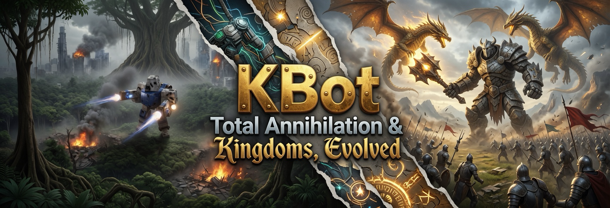

# Total Annihilation & TA: Kingdoms Format Reference



A field guide to the proprietary file formats Cavedog Entertainment shipped
in *Total Annihilation* (1997) and *Total Annihilation: Kingdoms* (1999),
written from a working reverse-engineering perspective. Every page pairs the
on-disk byte layout with a one-line **`kbot`** command so you can poke at the
real files alongside the prose.

> [!TIP]
> **First time here?** Read [Quickstart](quickstart.md) — five commands
> that show off the toolkit in five minutes.

> [!NOTE]
> If you have not yet, install the toolkit and register a context first:
>
> ```bash
> go install github.com/coreprime/kbot/cmd/kbot@latest
> kbot ctx add ~/games/totala --alias ta --game totala
> ```
>
> Once a context is current, most commands (`kbot tnt preview …`,
> `kbot gaf list …`, `kbot mount --server`) resolve bare filenames against
> every HPI/UFO/CCX/GP3 archive in the install — no more typing absolute
> paths.

---

## Format catalogue

### Container & wrapper formats

| Page | Extensions | Purpose | First class? |
|------|-----------|---------|--------------|
| [HPI / UFO / CCX / GP3](hpi.md) | `.hpi` `.ufo` `.ccx` `.gp3` | Encrypted, compressed archive — the wrapper for everything else | TA ✅ &nbsp; TA:K ✅ |

### Graphics & media

| Page | Extensions | Purpose | First class? |
|------|-----------|---------|--------------|
| [GAF](gaf.md) | `.gaf` `.taf` | Indexed-colour sprite animations (cursors, explosions, unit gadgets, features) | TA ✅ &nbsp; TA:K ✅ |
| [TAF / TSF](taf.md) | `.taf` `.tsf` | TA: Kingdoms **truecolor** (16-bit ARGB) animations — spell effects, explosions, menu backgrounds — plus their editable text form | TA:K ✅ |
| [PCX](pcx.md) | `.pcx` | ZSoft Paintbrush bitmap — unit portraits, GUI panels, and TA:K palette carriers | TA ✅ &nbsp; TA:K ✅ |
| [PAL / ALP / LHT / SHD](pal.md) | `.pal` `.alp` `.lht` `.shd` | 256-entry colour palette and 256×4 colour lookup tables | TA ✅ |
| [FNT](fnt.md) | `.fnt` | 1-bit-per-pixel variable-width bitmap font | TA ✅ |
| [Smacker / ZRB](smacker.md) | `.smk` `.zrb` | Cutscene video (RAD Game Tools Smacker, renamed `.zrb`) | TA ✅ |
| [Bink](bik.md) | `.bik` | TA: Kingdoms cutscene video (RAD Bink 1) — Smacker's successor | TA:K ✅ |
| [WAV / Sound](sound.md) | `.wav` | Plain WAV plus the three-layer sound-bank wiring | TA ✅ &nbsp; TA:K ✅ |

### Maps & terrain

| Page | Extensions | Purpose | First class? |
|------|-----------|---------|--------------|
| [SCT](sct.md) | `.sct` | Reusable map sections stitched together to build `.tnt` maps | TA ✅ |
| [TNT](tnt.md) | `.tnt` | A complete playable map (tile grid + heightmap + minimap + feature list) | TA ✅ |
| [TA:K maps](takmap.md) | `.tnt` `.ota` `.crt` `.kmp` | TA: Kingdoms map pipeline — texture-mapped terrain + minimap render, and the `.crt` scenario sidecar (placed units, rules, triggers) | TA:K 🟡 |

### Units, scripts, configs

| Page | Extensions | Purpose | First class? |
|------|-----------|---------|--------------|
| [3DO](3do.md) | `.3do` | Hierarchical 3D unit/feature mesh with palette-indexed faces | TA ✅ |
| [COB / BOS](cob.md) | `.cob` `.bos` | Stack-based animation/scripting bytecode that drives every unit | TA ✅ &nbsp; TA:K ✅ |
| [TDF / FBI / OTA](tdf.md) | `.tdf` `.fbi` `.ota` | INI-style configuration trees — unit stats, weapons, map metadata. Includes full [FBI field dictionary](tdf.md#appendix-a--fbi-field-dictionary). | TA ✅ &nbsp; TA:K ✅ |
| [Gamedata TDFs](gamedata.md) | `gamedata/*.tdf` | Movement classes, side data, sound bindings, weapon reference | TA ✅ |
| [AI profiles](ai.md) | `ai/*.txt` | Plain-text per-difficulty AI weights and unit limits (TAK profiles are plan-less; [see TAK note](ai.md#ta-kingdoms--plan-less-profiles)) | TA ✅ &nbsp; TA:K ✅ |

### TA: Kingdoms GUI

| Page | Extensions | Purpose | First class? |
|------|-----------|---------|--------------|
| [TA:K GUI](takgui.md) | `.gui` | Whitespace-delimited widget tree for *TA: Kingdoms* menus | TA:K ✅ |

### Tutorials & reference

| Page | Content |
|------|---------|
| [Quickstart](quickstart.md) | Five commands to try first. |
| [Modding a unit](modding.md) | End-to-end tutorial: extract → edit → repack → test (TA). |
| [Pitfalls](pitfalls.md) | Single-page cheat-sheet of every gotcha across the format docs. |
| [TA vs TA:K formats](compare.md) | Single-page matrix of what's shared, similar, or game-exclusive. |
| Reference catalogues | Standalone repos: [coreprime/reference-ta](https://github.com/coreprime/reference-ta) — 278 units / 199 weapons / 45 builders; [coreprime/reference-tak](https://github.com/coreprime/reference-tak) — 203 units / 198 weapons / 32 builders. |
| [Glossary](glossary.md) | Common terms (piece, axis, sealevel, signal mask, …). |
| [Image gallery](img/README.md) | Every figure in the docs with the producing command. |

**Legend:** ✅ first-class kbot support · 🟡 documented but not parsed by kbot today.

---

## How the formats fit together

```text
                                ┌───────────────────────────────┐
                                │   HPI / UFO / CCX / GP3       │
                                │   (encrypted, compressed VFS) │
                                └──────────────┬────────────────┘
                                               │ contains
            ┌──────────────────────┬───────────┼───────────────┬──────────────────┐
            ▼                      ▼           ▼               ▼                  ▼
        ┌───────┐             ┌───────┐   ┌───────┐       ┌────────┐        ┌─────────┐
        │  FBI  │ unit stats  │  COB  │   │  3DO  │ mesh  │  GAF   │ sprites│   TNT   │ map
        └───┬───┘             └───┬───┘   └───┬───┘       └────┬───┘        └────┬────┘
            │ references          │ runs on   │ textured by    │ used by         │ built from
            ▼                     ▼           ▼                ▼                 ▼
        ┌───────┐             ┌───────┐   ┌───────┐       ┌────────┐        ┌─────────┐
        │  TDF  │ weapons     │ piece │   │  PCX  │ skins │  PAL   │ colour │   SCT   │ tiles
        │ /OTA  │ /features   │ tree  │   │  unitpic│      │ /ALP/LHT/SHD   │ + heights
        └───────┘             └───────┘   └───────┘       └────────┘        └─────────┘
```

Almost every reverse-engineering session begins by mounting an HPI — even
flattened installs are just an HPI extraction. From there, units (`FBI`)
point at meshes (`3DO`), scripts (`COB`), unit portraits (`PCX`), and
animation gadgets (`GAF`). Maps (`TNT`) are assembled from sections (`SCT`)
and feature placements that resolve into `TDF` feature definitions.

> [!NOTE]
> **Mount the whole install at once.** Instead of poking at one archive at
> a time, point `kbot mount` at the install root. It walks every HPI/UFO/CCX
> in the folder and layers the contents into a single virtual filesystem so
> you can browse `units/ARMCOM.fbi` without caring which archive it came
> from.
>
> ```bash
> kbot mount ~/games/totala --server   # opens at http://localhost:8090
> ```

---

## Endianness, character set & coordinate conventions

These hold across every format in this document unless a page explicitly
overrides them:

| Property | Convention |
|----------|-----------|
| **Endianness** | Little-endian (Intel x86). |
| **String encoding** | ASCII / CP-437, NUL-terminated. TA:K added partial Windows-1252 support but never UTF-8. |
| **Numeric widths** | `uint8` (`char`), `uint16` (`short`), `uint32` (`long`). 64-bit values do not appear. |
| **Coordinate origin** | Images, tile grids, attribute grids — `(0, 0)` is the **top-left**. 3DO meshes use Y as **vertical** (up). |
| **3D fixed-point scale** | 3DO models use 16-bit fractional fixed-point: `value / 65536.0` ≈ world-space units. |
| **Game tick rate** | 30 ticks/second. Most timing fields in COB and GAF use ticks. |
| **Transparent colour** | Palette index 0 is the engine-wide transparent sentinel. The colour at that index varies between palettes but is treated as "show through" everywhere. |

> [!IMPORTANT]
> **Always validate magic numbers before trusting an offset.** Several
> formats (HPI, COB, GAF, TNT, SCT) carry a 32-bit signature in the first
> field. If the value does not match, the file is either corrupted, from a
> mod that uses a private format, or — for TA:K — a `.taf`/`.tsf` variant
> with a different version word.

---

## Working with this documentation

Every per-format page is structured the same way:

1. **What it is** — purpose and where it appears in a TA install.
2. **On-disk layout** — header struct, then payload sections, with byte
   offsets called out.
3. **Reading order** — the sequence of seeks/reads that successfully parse
   the file.
4. **Worked example** — a real Cavedog file dissected byte-by-byte.
5. **Inspect it yourself** — `kbot` commands you can run against your own
   install to see the data live.
6. **Gotchas** — undocumented edge cases, version differences, scratch
   bytes left in by Cavedog tools, etc.

If a callout looks like this:

> [!TIP]
> **Try it yourself.**
> ```bash
> kbot pal swatch palettes/palette.pal --target out.png --cell 24
> ```

…then the command is meant to be runnable verbatim once a context is set.

---

## Credits & source materials

These docs synthesise decades of community reverse-engineering work. Pages
attribute specific findings inline, but the foundations come from:

- Joe D. — original HPI format dissection (1997).
- Saruman & Bobban / dFR Engineering — first TNT walkthrough (1997).
- Scott "me22" McMurray — TNT format clarifications (2003), drawing on
  Kinboat's Annihilator source.
- Kinboat — SCT format, GAF tooling, Annihilator map editor.
- Dan Melchione & Dark Rain — 3DO format (1998, revised 2002).
- C_A_P, Switeck, KhalvKalash — COB/BOS opcode reverse engineering and the
  Scriptor tool family.
- Dark Rain — TA:K GUI format and the TA:K format-challenges notes.
- Cavedog Entertainment — for making a game worth keeping alive 25+ years
  later.

When this documentation conflicts with one of those originals, the kbot
source code is the source of truth — the formats here are tested round-trip
against thousands of real Cavedog files. If you find a discrepancy, open an
issue or PR at <https://github.com/coreprime/kbot>.
