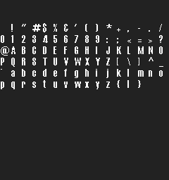

# FNT — 1-bit Bitmap Fonts

> Total Annihilation ships a stable of `.fnt` files for everything from
> the on-screen radio chatter (`comix.fnt`) to the unit briefing screens
> (`armbrief.fnt`). They're tiny, variable-width, **1 bit per pixel**
> bitmap fonts indexed by 8-bit character code — basically a sprite
> sheet with a lookup table.

<p align="center">
  
  <br/>
  <em>fonts/comix.fnt rendered as a 16-column sprite sheet by <code>kbot fnt sheet</code></em>
</p>

<p align="center">
  
  <br/>
  <em><code>kbot fnt render comix.fnt --text "kbot" --fg "#ffff00" --bg "#000000"</code></em>
</p>

> [!TIP]
> **Try it yourself.**
> ```bash
> kbot fnt info     fonts/comix.fnt                    # one-line summary
> kbot fnt describe fonts/comix.fnt --list             # full metadata + glyph list
> kbot fnt sheet    fonts/comix.fnt -o sheet.png       # all glyphs as a grid
> kbot fnt render   fonts/comix.fnt --text "Commander" --fg "#ffff00" --bg transparent -o caption.png
> kbot fnt dump     fonts/comix.fnt -t ./glyphs        # one PNG per character
> ```
> See the CLI [`kbot fnt` reference](../../README.md#kbot-fnt--bitmap-fonts).
>
> **From Go.** Use [`formats/fnt`](../../formats/fnt/fnt.go):
> ```go
> import "github.com/coreprime/kbot/formats/fnt"
>
> f, _ := os.Open("fonts/comix.fnt")
> defer f.Close()
> font, _ := fnt.LoadFromReader(f)
> fmt.Println(font.Height, "px,", font.GlyphCount(), "glyphs")
> if g := font.Glyphs['A']; g != nil {
>     fmt.Println("A is", g.Width, "px wide")
> }
> ```

---

## On-disk layout

```
┌─ 4-byte header ──────────┐
│ uint8   Height           │   byte 0: shared by every glyph; the line height
│ uint8   (ignored)        │   byte 1: not part of the height
│ int8    Baseline         │   byte 2: rows the glyphs extend above the pen
│ uint8   FirstChar        │   byte 3: code of the first offset-table entry
├─ (256 − FirstChar) × u16 ┤   file offsets; 0 = glyph not defined
├─ Glyph data ─────────────┤   for each defined glyph:
│   uint8  Width           │   pixel width (1..255), also the pen advance
│   ⌈Width × Height/8⌉     │   1bpp pixels, MSB-first bit stream
└──────────────────────────┘
```

Every retail font has `FirstChar = 0`, so its header + offset table is
`4 + 256 × 2 = 516` bytes and glyph data starts immediately after.

| Field | Notes |
|-------|-------|
| `Height` | Byte 0 only. Pixel height shared by every glyph in the font (9–17 in the retail fonts). |
| `Baseline` | Byte 2, signed. Text drawn with the pen at row `y` puts the glyphs' top row at `y − Baseline`. Retail fonts store 1–3. |
| `FirstChar` | Byte 3. Character `c` uses offset-table entry `c − FirstChar`; codes below it have no glyph. Retail fonts store 0. |
| `Offsets[]` | Indexed by character byte (the retail game's text is Windows-1252). `0` means *no glyph for this character*. Non-zero values are offsets from the start of the font pointing at the glyph's `Width` byte. |
| Glyph `Width` | 1–255. A width of 0 makes the game advance by 0 and draw garbage; kbot skips such glyphs and reports them. |

Older tools read bytes 2–3 as one opaque "flags" word; they are two
separate fields.

---

## Reading a glyph

The glyph payload is a **continuous bit stream**, MSB-first, packed left-
to-right then top-to-bottom — i.e. row-major scan. The number of bits is
`Width × Height` and the number of stored bytes is `⌈(Width × Height) / 8⌉`.

```python
def read_glyph(file, offset, height):
    file.seek(offset)
    width = file.read(1)[0]
    if width == 0 or width > 128:
        return None
    n_bits  = width * height
    n_bytes = (n_bits + 7) // 8
    bits    = file.read(n_bytes)
    pixels  = []
    for i in range(n_bits):
        bit = (bits[i // 8] >> (7 - (i % 8))) & 1
        pixels.append(bool(bit))
    return Glyph(width, height, pixels)
```

There is no kerning data and no advance width separate from `Width`.
The game lays text out like this, and `kbot fnt render`, the MCP
`fnt_render` tool and the asset explorer's text preview do the same:

- each **byte** of the text selects the glyph with that code (convert
  UTF-8 text to the game's code page first; `kbot fnt render --codepage`
  defaults to Windows-1252);
- a glyph advances the pen by **exactly its width**, with no gap;
- a character with no glyph draws nothing and advances by **0**;
- drawing stops at the first **NUL or newline**.

A 13-row font with a 10-pixel `A` and no space glyph therefore draws
`"A A"` 20 pixels wide.

> [!NOTE]
> **There is no padding between rows.** Each scan line continues from
> wherever the previous one ended in the same byte. A glyph 5 pixels
> wide and 7 pixels tall uses `⌈35/8⌉ = 5` bytes, with the 5 trailing
> bits ignored.

---

## Worked example — `comix.fnt`

```
$ kbot fnt describe fonts/comix.fnt
Height:        14 px
Baseline:      1 (glyph rows start this many rows above the pen)
First char:    0x00
Glyphs:        94 / 256 defined
Glyph width:   min=3 max=13 mean=5.9
Ranges:        0x20-0x7D
```

Reading this: it's a 14-pixel-high font covering printable ASCII (space
through `}`). Widths vary from 3 (`i`, `l`) to 13 (`M`, `W`). The 162
undefined slots are mostly non-printable control characters; the rest are
Latin-1 extras that the game doesn't display.

The offset table for the first ten characters of `comix.fnt`:

```
char  offset    width  bytes  meaning
0x20  0x021C    4      7     space
0x21  0x0223    3      5     '!'
0x22  0x0228    5      9     '"'
0x23  0x0231    6     11     '#'
0x24  0x023C    5      9     '$'
...
```

You can dump the same thing with `kbot fnt describe --list`.

---

## Rendering tips

`kbot fnt render` supports:

| Flag | Effect |
|------|--------|
| `--text "..."` | The string to render: one line; drawing stops at the first newline, as in the game. |
| `--codepage NAME` | Code page the UTF-8 text is converted to: `cp1252` (default, the retail game's), `cp1250`, `cp1251`, `cp437`, `cp850`, `iso-8859-1`, `iso-8859-15`, or `raw` to pass the bytes through. Characters without a byte become `?`. |
| `--fg #rrggbb[aa]` | Foreground colour. Default: white. |
| `--bg #rrggbb[aa]` &#124; `transparent` | Background. Default: transparent. |
| `--target PATH` | Output PNG path. Stdout otherwise. |

A character not present in the font draws nothing and takes no space,
as in the game.

---

## Gotchas

> [!WARNING]
> **`Offsets[c] == 0` means "no glyph", not "glyph at offset 0".** Offset
> 0 lands in the middle of the header and is structurally impossible —
> Cavedog reuses the sentinel to mean *undefined*. Always treat zero
> offsets as missing.

- **Bit order is MSB-first** within each byte. LSB-first is the more
  common convention in modern bitmap fonts; don't assume.
- **Bit stream is continuous between rows** — there's no padding to a
  byte boundary at the end of each scan line.
- **Bytes 2 and 3 are the baseline and the first character code**, not
  a flags word. A non-zero first character code shortens the offset
  table.
- **Characters are bytes, not Unicode code points.** `€` is byte `0x80`
  in Windows-1252; taking a code point modulo 256 picks the wrong glyph.
- **No metadata about which characters are supported.** You have to
  iterate the offset table to discover the glyph set.

---

## Typical sizes

| Asset | Range observed in Cavedog `fonts/*.fnt` |
|-------|-----------------------------------------|
| File size | 700 B – 4 KB |
| Header + offset table | always 516 bytes |
| Glyph height | 9–17 px |
| Glyph width | 3–13 px |
| Defined glyphs per font | 60–120 (most are printable ASCII only) |
| Per-glyph data | typically 5–30 bytes (1 width byte + packed bits) |

---

## See also

- [PAL](pal.md) — fonts don't carry a palette; the renderer needs you to
  pick a fg/bg colour or use the TA palette manually.
- [Glossary](glossary.md) — *1bpp*, *MSB-first bit stream*.
