# Example images

Every figure in the format reference lives here. Each row shows the
image, the command that produced it, and the format page that
embeds it. The commands assume a current [kbot
context](../../../README.md#kbot-ctx--working-directory-contexts)
pointing at a complete TA install — adjust paths if you're running
against a flattened directory.

> [!TIP]
> Want to regenerate everything in one shot after pulling new game
> assets? Re-run the commands below in order; each one writes to a
> fixed filename and is idempotent.

---

## Palettes

| Image | Source command | Used in |
|-------|----------------|---------|
| 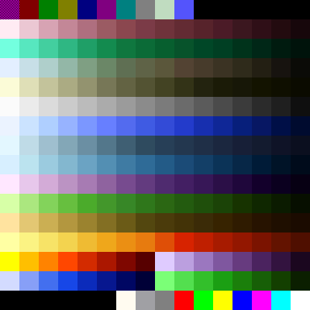 | `kbot pal swatch palettes/palette.pal -o palette.png --cell 24` | [pal.md](../pal.md) |
| 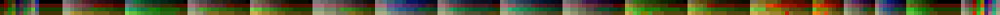 | `kbot pal lookup palettes/palette.alp --palette palettes/palette.pal -o pal-alp-lookup.png` | [pal.md](../pal.md) |

## Fonts

| Image | Source command | Used in |
|-------|----------------|---------|
| 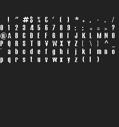 | `kbot fnt sheet fonts/comix.fnt -o fnt-sheet.png` | [fnt.md](../fnt.md) |
|  | `kbot fnt render fonts/comix.fnt --text "kbot" --fg "#ffff00" --bg "#000000" -o fnt-hello.png` | [fnt.md](../fnt.md) |

## Sprites

| Image | Source command | Used in |
|-------|----------------|---------|
|  | `kbot gaf export anims/cursors.gaf --format gif --sequence 0 -o gaf-cursor.gif` | [gaf.md](../gaf.md) |
|  | `kbot gaf export anims/cursors.gaf --format png --sequence 2 -o gaf-cursorselect.png` | [gaf.md](../gaf.md) |
| 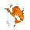 | `kbot taf export anims/fireballa_1555.taf --format gif -o taf-fireball.gif` | [taf.md](../taf.md) |
|  | `kbot taf render anims/bluefire_4444.taf --frame 4 -o taf-bluefire-frame.png` | [taf.md](../taf.md) |
| 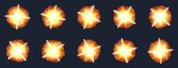 | `kbot taf sheet anims/manabomb_1555.taf --cols 5 --bg "#1b2330" -o taf-manabomb-sheet.png` | [taf.md](../taf.md) |

## Bitmaps

| Image | Source command | Used in |
|-------|----------------|---------|
| 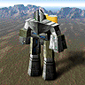 | `kbot pcx convert unitpics/armcom.pcx -f png -o pcx-armcom.png` | [pcx.md](../pcx.md) |

## Map sections

| Image | Source command | Used in |
|-------|----------------|---------|
| 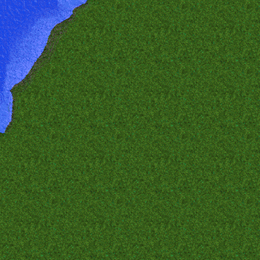 | `kbot sct image sections/greenworld/coast/b_n_w02_135.sct -t sct-image.png` | [sct.md](../sct.md) |
| 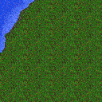 | `kbot sct minimap sections/greenworld/coast/b_n_w02_135.sct -t sct-minimap.png` | [sct.md](../sct.md) |
|  | `kbot sct heightmap sections/greenworld/coast/b_n_w02_135.sct -t sct-heightmap.png` | [sct.md](../sct.md) |

## TNT maps

| Image | Source command | Used in |
|-------|----------------|---------|
| 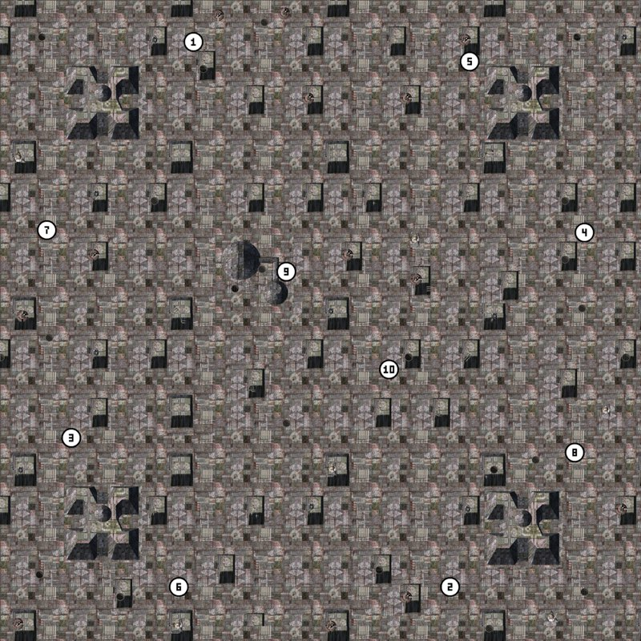 | `kbot tnt preview "maps/metal heck.tnt" --vfs <flat install> -t /tmp/metal.png` + `sips -Z 800` for size | [tnt.md](../tnt.md) |
| 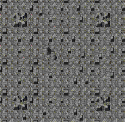 | `kbot tnt minimap "maps/metal heck.tnt" -t tnt-minimap.png` | [tnt.md](../tnt.md) |
| 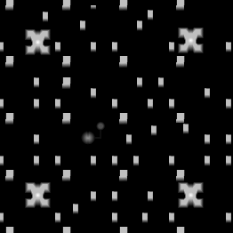 | `kbot tnt heightmap "maps/metal heck.tnt" --normalize -t tnt-heightmap.png` | [tnt.md](../tnt.md) |

---

## Adding a new image

1. Run the producing command into this directory.
2. Add a row to the appropriate section above.
3. Reference the image from the format page with a relative path
   (e.g. ``).
4. If it's large, consider running `sips -Z 1024 …` to keep the docs
   tree under GitHub's "rendered slowly" threshold.
