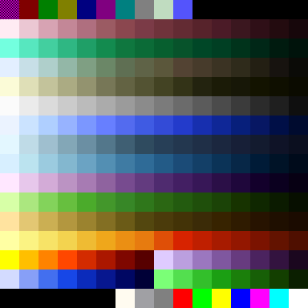
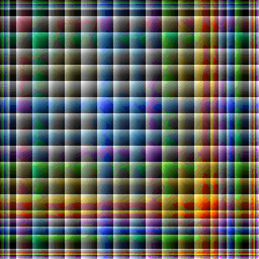

# PAL / ALP / LHT / SHD — Palettes and Colour Lookup Tables

> Total Annihilation shipped its entire world in **256 colours**. The
> `.pal` file holds that palette; the `.alp`, `.shd` and `.lht` files are
> lookup tables built from it that the engine uses to blend, shade and
> light pixels without leaving the indexed colour space.
>
> None of the four has a header, version field or compression. A `.pal`
> is 1,024 bytes (256 × RGBx); `.alp` is 65,536 bytes (256 rows of 256
> palette indices) and `.shd` / `.lht` are 8,192 bytes each (32 rows of
> 256 palette indices).

<p align="center">
  
  <br/>
  <em>palettes/palette.pal — rendered by <code>kbot pal swatch</code></em>
</p>

> [!TIP]
> **Try it yourself.**
> ```bash
> kbot pal info     palettes/palette.pal              # one-liner
> kbot pal describe palettes/palette.pal              # full RGB dump
> kbot pal swatch   palettes/palette.pal -o pal.png --cell 24
>
> # Render a lookup table, coloured by the palette:
> # .alp as 256×256 cells, .shd / .lht as 256×32 cells
> kbot pal lookup   palettes/palette.alp --palette palettes/palette.pal --target alp.png
> kbot pal lookup   palettes/palette.shd --target shd.png
> # TA: Kingdoms: the palette is usually a PCX next to its tables
> kbot pal lookup   palettes/aramon.alp --palette palettes/aramon.pcx --target aramon.png
>
> # Round-trip to editor-friendly formats
> kbot pal convert  palettes/palette.pal -o palette.gpl                  # GIMP
> kbot pal convert  palettes/palette.pal -o palette.txt --format jasc    # JASC
> ```
> See the CLI [`kbot pal` reference](../../README.md#kbot-pal--palettes--lookup-tables).
>
> **From Go.** Use [`formats/pal`](../../formats/pal/pal.go):
> ```go
> import "github.com/coreprime/kbot/formats/pal"
>
> p, _ := pal.LoadFromFile("palettes/palette.pal")
> fmt.Printf("RGB[0] = %v (black; sprites key it per frame)\n", p.Colors[0])
> for i, c := range p.Colors {
>     fmt.Printf("%3d  #%02x%02x%02x\n", i, c.R, c.G, c.B)
> }
> ```

---

## On-disk layout (`.pal`)

```c
typedef struct {
    uint8 R;
    uint8 G;
    uint8 B;
    uint8 A;     // Unused. Cavedog files have this as 0 throughout.
} PALEntry;

PALEntry entries[256];   // 256 × 4 = 1024 bytes
```

There is no signature and no version. The game loads
`palettes/<name>.pal` like this (kbot-io's `pal.LoadNamed` does the same,
and the studio and asset explorer load `palette.pal` through it):

- **1,024 bytes or more:** the first 1,024 bytes are the palette; the rest
  is ignored.
- **Empty or missing:** the palette comes from `palettes/<name>.pcx`
  instead — the last 768 bytes of that file, whether or not a `0x0C`
  marker precedes them. TA 3.1c then rebuilds the `.alp`, `.shd` and
  `.lht` tables for those colours.
- **1 to 1,023 bytes:** not usable; the game reads 1,024 bytes past the
  end of the file. kbot reports an error (and the studio falls back to
  the built-in TA palette).

---

## `.pal` — the canonical TA palette

The bytes `R`, `G`, `B`, `A` per entry literally mean *red*, *green*,
*blue*, *unused*. **Index 0 is ordinary black.** Terrain tiles,
minimaps and backdrops draw it opaque (62 of the 275 retail maps use it
in their tiles). Transparency is decided per image, not by the palette:
a GAF frame's key byte (often 9, sometimes 0) and its skipped pixels are
transparent, and model textures are sampled without a key.

| Index | TA convention | Notes |
|------:|---------------|-------|
| `0` | Black | Opaque in terrain, minimaps and backdrops; transparent only in sprite frames whose key is 0. |
| `9` | "Magic pink" | Used by editor tooling as a fill colour for transparent regions in PCX/GAF before encoding; not transparent at runtime. |
| `16–95` | Player-colour cycles | The engine swaps these out per side to recolour units. |
| `223–254` | Reserved | Mostly used by team-colour cycles and special effects. |
| `255` | Pure white | Frequently used for laser cores. |

> [!NOTE]
> **The 256 RGB triplets are not arbitrary.** Cavedog hand-tuned the
> palette so that smooth ramps exist for each of the major
> material families (metal, organic, water, sky, lava, …). Replacing
> entries to mod a "new" colour in usually breaks every unit that drew
> from that ramp. See `pal describe`'s output for the ramp groupings.

---

## `.alp` / `.shd` / `.lht` — colour lookup tables

These three files **are not RGB data**: every byte is a palette index.
Each table has one 256-entry row per blend partner or level, and its
columns are the 256 source colours:

| File | Size | Rows | Entry `[r][c]` |
|------|-----:|-----:|----------------|
| `.alp` (alpha) | 65,536 | 256 | The index nearest the average of colours `r` and `c`: a half-and-half blend, used for translucent drawing. Symmetric, and `[c][c]` is `c`. |
| `.shd` (shade) | 8,192 | 32 | The index nearest colour `c` scaled by `r × 0.06875`: row 0 is black, rows 14–15 leave colours nearly unchanged, higher rows brighten them. |
| `.lht` (light) | 8,192 | 32 | The index nearest colour `c` scaled by `1 + r/30`, from unchanged (row 0) to about twice as bright. |

```c
uint8 alp[256][256];   // blend = alp[a][b]
uint8 shd[32][256];    // shaded = shd[level][c]
uint8 lht[32][256];    // lit    = lht[level][c]
```

Practically: the engine never blends colours arithmetically — it does a
table lookup, so the resulting pixel is always a real palette index that
can be drawn through the existing 8bpp pipeline. This is why all the
shadows in TA look like a darker version of the same colour ramp, not
"50% black overlaid": each shaded result is the palette index closest to
that mathematical mix.

The game uses a table file only when its size is exact; a missing table
or one of any other size is rebuilt from the palette. `kbot pal lookup`
therefore rejects files of any other size. TA: Kingdoms ships tables of
the same sizes for nearly every palette in its `palettes/` folder; most
of those palettes are PCX files, and `kbot pal lookup --palette` takes a
`.pcx` as well as a `.pal`.

> [!IMPORTANT]
> **A lookup table is not a palette.** Rendering a `.alp` with `kbot pal
> describe` will show you garbage RGB values because the bytes are not
> RGB. Use `kbot pal lookup` to see what they actually do — pass the
> companion `.pal` so each lookup cell can be coloured with the palette
> entry it resolves to.

---

## Worked example — `palette.pal`

The first 16 entries of the stock TA palette:

| Idx | Hex | R G B | Role |
|----:|-----|-------|------|
| 0 | `#000000` | 0 0 0 | **Black** (opaque in terrain; the key of some sprite frames) |
| 1 | `#800000` | 128 0 0 | Dark red |
| 2 | `#008000` | 0 128 0 | Dark green |
| 3 | `#808000` | 128 128 0 | Olive |
| 4 | `#000080` | 0 0 128 | Dark blue (water shadow) |
| 5 | `#800080` | 128 0 128 | Dark magenta |
| 6 | `#008080` | 0 128 128 | Dark cyan |
| 7 | `#808080` | 128 128 128 | Mid grey |
| 8 | `#C0DCC0` | 192 220 192 | Pale green |
| 9 | `#5454FC` | 84 84 252 | **"Magic pink"** (editor transparency) |
| 10–15 | `#000000` × 6 | 0 0 0 | Reserved padding |

`kbot pal describe palettes/palette.pal` prints the full table.

---

## Worked example — `palette.alp` and `palette.shd` as lookups

Rendering the tables with the palette as colour source
(`kbot pal lookup … --cell 2`):

<p align="center">
  
  <br/>
  <em>palette.alp: 256 × 256 cells. Row a, column b shows the blend of colours a and b;<br/>
      the diagonal reproduces each colour.</em>
</p>

<p align="center">
  
  <br/>
  <em>palette.shd: 256 × 32 cells. Each column is a source colour;<br/>
      rows run from black (row 0) through the colour itself to brighter shades.</em>
</p>

Reading the shade table: column 80 (mid-grey) starts black in row 0,
climbs through darker greys of its ramp, reaches itself around rows 14
and 15, and then brightens. The engine never needs to multiply RGB
values — it just reads `shd[level][c]`.

---

## Converting palettes for editors

`kbot pal convert` understands several editor-friendly output formats:

| Format | Extension | Tool |
|--------|-----------|------|
| Binary TA `.PAL` | `.pal` | The format itself; useful for re-emitting after edits. |
| GIMP Palette | `.gpl` | GIMP, Krita, Inkscape. |
| JASC-PAL (text) | `.pal` / `.txt` (`--format jasc`) | Paint Shop Pro, Aseprite. |
| PNG swatch | `.png` (via `kbot pal swatch`) | Visual reference; not loadable as a palette. |

The reverse direction — importing a `.gpl` or `.pal` (JASC) back into a
binary TA `.pal` — works as long as the source has 256 entries.

> [!NOTE]
> **The TA palette has 13 duplicate RGB triplets.** If your editor
> deduplicates colours on import (some do), you'll lose entries and the
> palette will silently become a 243-entry palette. `kbot pal info`
> reports the duplicate count so you can spot the difference; round-trip
> through `kbot pal convert -o roundtrip.pal` to verify.

---

## Gotchas

> [!WARNING]
> **The 4th byte per entry is not alpha.** It's an unused padding byte
> Cavedog always set to `0x00`. Several open-source palette tools read
> it as alpha, then refuse to render the palette (alpha=0 everywhere ⇒
> all transparent). kbot ignores it on read and emits `0x00` on write.

- **Index 0 is not transparent by itself.** Terrain, minimaps and
  backdrops draw it as black; a sprite frame is transparent only where
  its own key (or skip run) says so. kbot's terrain and minimap renders
  use an opaque palette.
- **No magic numbers means weak validation.** The only way to sanity-check
  a `.pal` is to require at least 1024 bytes and (optionally) that the
  alpha byte is zero in every entry.
- **A lookup table of the wrong size is ignored by the game** and rebuilt
  from the palette.
- **`.alp` / `.lht` / `.shd` are not interchangeable.** They're tuned for
  different effects; swapping them will produce visibly wrong shadows or
  lighting.
- **TA: Kingdoms uses per-side PCX-embedded palettes**, not the global
  `.pal` workflow. See [PCX](pcx.md) for the carrier-PCX trick.

---

## Typical sizes

| File | Size | Notes |
|------|-----:|-------|
| `palette.pal` | 1,024 bytes | The game reads the first 1,024 bytes of a longer file. |
| `palette.alp` | 65,536 bytes | 256 × 256 palette indices. |
| `palette.shd` / `palette.lht` | 8,192 bytes | 32 × 256 palette indices. |
| GIMP `.gpl` export | ~5 KB | Text format, much larger than binary. |
| JASC `.pal` (text) export | ~3 KB | Same. |
| `kbot pal swatch` PNG | 1–10 KB | Depends on `--cell` size. |
| Total palette files in stock TA | ~15 files | One canonical `palette.*` set plus a few alt UI palettes. |

---

## See also

- [PCX](pcx.md) — files with embedded palettes (and TA:K's
  palette-carrier convention).
- [GAF](gaf.md) — animations that *use* a palette but don't include one.
- [TNT](tnt.md), [SCT](sct.md) — paletted tile data on disk.
- [Glossary](glossary.md) — *paletted image*, *lookup table*.
