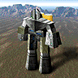

# PCX — ZSoft Paintbrush Bitmap

> **PCX** is an early-90s indexed-colour bitmap format. Total Annihilation
> uses it for unit portraits (`unitpics/*.pcx`), GUI panels, and a handful
> of map preview images. In *TA: Kingdoms*, a 1×1 PCX is also the carrier
> for per-side palettes — the engine reads the embedded palette out of
> the PCX and applies it to a sibling `.taf` animation file.

<p align="center">
  
  <br/>
  <em>unitpics/armcom.pcx → PNG (TA palette)</em>
</p>

> [!TIP]
> **Try it yourself.**
> ```bash
> kbot pcx describe unitpics/armcom.pcx        # full header + what TA will do with it
> kbot pcx info     unitpics/armcom.pcx        # one-line summary
> kbot pcx convert  unitpics/armcom.pcx -f png -o armcom.png
> ```
> See the CLI [`kbot pcx` reference](../../README.md#kbot-pcx--pcx-images).
>
> **From Go.** Use [`formats/pcx`](../../formats/pcx/pcx.go):
> ```go
> import "github.com/coreprime/kbot/formats/pcx"
>
> f, _ := os.Open("unitpics/armcom.pcx")
> defer f.Close()
> r, _ := pcx.LoadFromReader(f)
> fmt.Println(r.Width(), "×", r.Height(), "@", r.BitsPerPixel(), "bpp")
> img, _ := r.Decode()                          // returns image.Image
> ```

---

## PCX is a community format, not a Cavedog one

Cavedog did not invent PCX — it predates Windows. So unlike HPI, GAF or
TNT, the on-disk layout was already an open spec when TA shipped. This
page covers only what's relevant when you find a PCX inside a TA install;
for the full spec, see ZSoft's original technical reference.

The TA-relevant subset:

- **8 bits-per-pixel, 1 plane** — paletted images only. The 24-bit, 4-bit,
  and multi-plane variants exist but Cavedog doesn't ship any.
- **RLE encoding** (`Encoding = 1`). Uncompressed PCXs are technically
  legal but uncommon.
- **256-colour VGA palette appended after pixel data**, prefixed by a
  single `0x0C` marker byte. TA always uses this layout; the 16-colour
  palette in the header is ignored.

---

## Header (128 bytes)

```c
typedef struct {
    uint8  Manufacturer;     // Always 0x0A (ZSoft signature)
    uint8  Version;          // 0–5 (TA images are typically version 5)
    uint8  Encoding;         // 1 = RLE
    uint8  BitsPerPixel;     // Bits per plane per pixel (8 in TA)
    uint16 XMin, YMin;       // Image bounds (inclusive)
    uint16 XMax, YMax;
    uint16 HorzDPI, VertDPI;
    uint8  Palette16[48];    // Legacy 16-colour palette (unused in TA)
    uint8  Reserved;
    uint8  NumPlanes;        // 1 for 256-colour images
    uint16 BytesPerLine;     // Encoded bytes per scan line per plane
    uint16 PaletteInfo;      // 1 = colour, 2 = grayscale
    uint16 HorzScreen, VertScreen;
    uint8  Filler[54];       // Pad to 128 bytes (Cavedog leaves it zeroed)
} PCXHeader;
```

| Field | TA value | Notes |
|-------|----------|-------|
| `Manufacturer` | `0x0A` | Reject anything else — not a PCX. |
| `Version` | `5` | TA 3.1c loads version 5 only. |
| `BitsPerPixel × NumPlanes` | `8 × 1 = 8` | The only configuration TA ships, and the only one the game decodes. |
| `Encoding` | `1` | RLE — see below. The game RLE-decodes whatever the byte says. |
| `BytesPerLine` | `XMax − XMin + 1` | **Must equal the width for TA.** The game ignores it and reads exactly width bytes per row; image editors that pad rows to an even count produce files whose rows shift in the game. |

### Computed image size

```
Width  = XMax − XMin + 1
Height = YMax − YMin + 1
```

The game computes these in full integers, so a width of 65,536 is
possible, and refuses a file whose maximum is below its minimum. A
standard reader treats trailing bytes per scanline (`BytesPerLine −
Width`) as padding; the game does not (see below).

---

## RLE pixel data

For each of the `Height` scan lines, repeat:

```c
while (decoded < BytesPerLine) {
    uint8 b = read();
    if ((b & 0xC0) == 0xC0) {
        int count = b & 0x3F;        // 1..63 reps
        uint8 value = read();
        emit(value, count);
    } else {
        emit(b, 1);                  // literal
    }
}
```

A standard reader then **discards the trailing padding** (`BytesPerLine
− Width` bytes). TA 3.1c instead decodes exactly `Width` pixels per row,
straight on from the header, so any padding becomes the first pixels of
the next row; a run that crosses the end of a row is clipped there.

> [!IMPORTANT]
> **Literal bytes with the top two bits set must be RLE-escaped.** A bare
> byte of value `0xC0–0xFF` is illegal as a literal; you must emit it as a
> 1-count run (`0xC1, 0xFF` for a single `0xFF`). Writers that forget this
> produce files that decode for one row, then desynchronise.

---

## Embedded palette (256 entries × 3 bytes)

After the last RLE byte, the file ends with **769 bytes**:

```
   1 byte  : marker, always 0x0C
 256 × 3   : R, G, B per entry (8-bit each)
```

To find the palette without parsing the RLE, seek to `fileSize - 769`
and verify the marker. A standard reader without the marker falls back
to the header's 16-colour palette (kbot's previews use the TA palette).
**TA 3.1c always takes the last 768 bytes as the palette, marker or
not,** and refuses a file shorter than 896 bytes (header plus palette).

> [!NOTE]
> **In a TA install, the embedded palette will usually be the standard
> TA palette** — but not always. Mission-specific portraits sometimes
> ship private palettes, and `palettes/guipal.pcx` is a deliberate
> 1×1-pixel palette carrier with a custom GUI-tuned variant.

---

## What TA 3.1c does with a PCX

The game reads only the manufacturer, version and extent fields of the
header:

- It loads **version 5** only and refuses a file whose `XMax`/`YMax` is
  below its minimum or that is shorter than 896 bytes.
- It ignores `Encoding`, `BitsPerPixel`, `NumPlanes` and `BytesPerLine`:
  every file is run-length decoded as 8-bit single-plane data, `Width`
  bytes per row. A 24-bit file therefore shows as garbage and padded
  rows shift.
- The palette is the last 768 bytes, whatever precedes them.
- Backdrops are drawn **opaque**: palette index 0 is ordinary black.
- Pixel data that ends early does not stop it: it keeps drawing from the
  last byte it read.

Image editors read such files the standard way, so a mod backdrop can
look right in an editor (and in kbot's preview) and wrong in the game.
`kbot pcx describe` ends with a **TA 3.1c** section listing every
difference (kbot-io's `pcx.Reader.Compat`), the MCP `pcx_describe` tool
returns it as `game_loads` / `game_issues`, and the asset explorer shows
it as a badge next to the preview:

```
TA 3.1c:
  ⚠ The game will load this file but draw it differently:
    ⚠ BytesPerLine is 4 but the width is 3: the game ignores BytesPerLine and decodes 3 bytes per row, so the rows shift
```

---

## Worked example — `unitpics/armcom.pcx`

```
$ kbot pcx describe unitpics/armcom.pcx
Manufacturer:  0x0A
Version:       5
Encoding:      1 (RLE)
BitsPerPixel:  8
Planes:        1
Bounds:        (0,0) - (95,95)   →  96 × 96 px
BytesPerLine:  96
Palette:       embedded (768 bytes after 0x0C marker)
Unique colors: 41
```

That tells you everything you need to render the file by hand: 96×96
image, 41 distinct palette indices in use, palette appended at the end.
`kbot pcx convert -f png` exports it as a paletted PNG so the colour
indices survive round-trip back to PCX.

---

## TA: Kingdoms — the "palette PCX" trick

When you convert a TA `.gaf` to TA: Kingdoms, the engine needs a palette
but the `.taf` (renamed `.gaf`) has none. The trick is to drop a 1×1 PCX
with the same base filename next to the `.taf`:

```
ui/mywidget.taf      ← animation data
ui/mywidget.pcx      ← 1×1 paletted PCX carrying the 256-colour palette
```

The engine reads `mywidget.pcx`'s embedded palette and ignores its pixel.
For unit/feature animations the palette is implicit per side (Aramon,
Taros, Veruna, Zhon); for UI animations you drop a per-sequence PCX.

The most common pitfall here is using a PSP-exported palette, which has
slightly different RGB values than the canonical TA palette and can
crash TA:K on some sequences. `kbot pal swatch` will dump any palette
to a PNG so you can compare against the reference.

---

## Gotchas

> [!WARNING]
> **Write `BytesPerLine` equal to the width for TA.** A standard reader
> drops the padding when `BytesPerLine > Width`, but TA 3.1c ignores
> `BytesPerLine` and decodes `Width` bytes per row, so the padding skews
> every later row. `kbot pcx describe` warns about it.

- **The game uses the trailing 768 bytes as the palette whether or not
  the `0x0C` marker precedes them.** Standard readers without the marker
  fall back to the 16-colour header palette.
- **Only version 5 loads in TA.**
- **The header's `PaletteInfo` field is unreliable.** Treat it as advisory
  only; assume colour palettes unless every R==G==B in the embedded
  palette.
- **TA's `unitpics/*.pcx` files are 96×96 by convention** — not enforced
  by the format. Mods occasionally ship larger or non-square portraits.

---

## Typical sizes

| Asset | Dimensions | File size |
|-------|-----------|-----------|
| `unitpics/*.pcx` (unit portrait) | 96 × 96 | 3–12 KB |
| GUI panel (`bitmaps/*.pcx`) | various, often 64–256 px wide | 5–80 KB |
| Map preview | 252 × 252 | 30–80 KB |
| TA:K palette carrier | 1 × 1 | ~800 bytes (header + palette) |
| Header overhead | always 128 bytes | — |
| Embedded palette | always 769 bytes (when present) | — |

---

## See also

- [PAL](pal.md) — when the palette lives in a separate file instead.
- [GAF](gaf.md) — TA: Kingdoms `.taf` files pair with a `.pcx` palette
  carrier.
- [Glossary](glossary.md) — *paletted image*, *embedded palette*.
