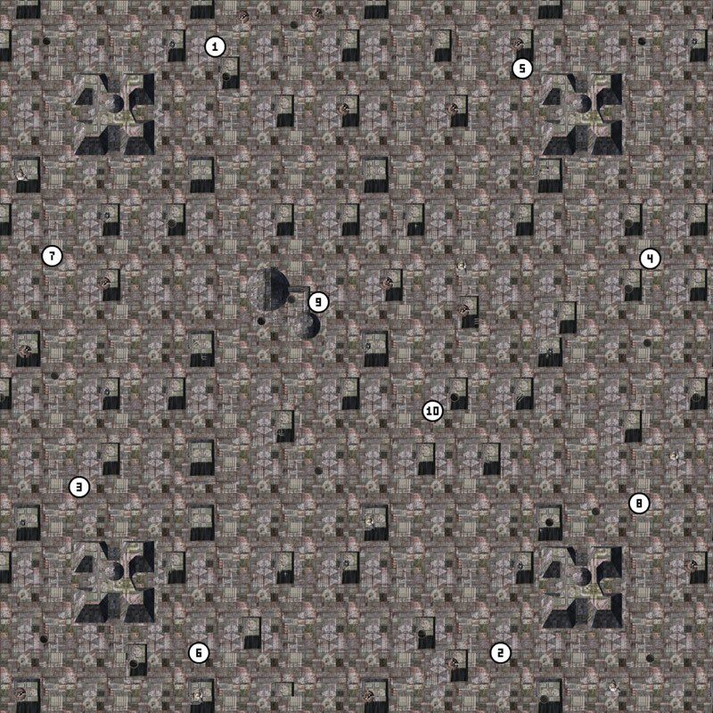
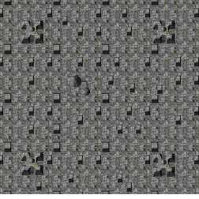
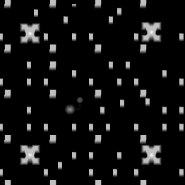

# TNT — Map Terrain

> A `.tnt` file is a **complete playable map**: tile graphics, terrain
> heights, feature placements (trees, rocks, hydration nodes, …), sea
> level, and a 252×252 minimap, all in a single self-contained file. There
> are no external dependencies for the geometry — drop a `.tnt` into a
> game folder and it will load. (The companion `.ota` file is metadata
> only: name, description, AI hints, start positions.)

<p align="center">
  
  <br/>
  <em>maps/metal heck.tnt — full preview with feature sprites composited from <code>features/*.tdf</code><br/>
      and start-position markers from the sister <code>.ota</code></em>
</p>

<p align="center">
  
  &nbsp;&nbsp;
  
  <br/>
  <em>Embedded minimap (left) and normalised elevation grid (right).</em>
</p>

> [!TIP]
> **Try it yourself.**
> ```bash
> kbot tnt describe  "maps/metal heck.tnt"
> kbot tnt minimap   "maps/metal heck.tnt" -t mini.png
> kbot tnt heightmap "maps/metal heck.tnt" --normalize -t h.png
> kbot tnt image     "maps/metal heck.tnt" -t map.png        # raw tile mosaic
> kbot tnt preview   "maps/metal heck.tnt" -t preview.jpg    # + feature sprites + StartPos
>
> # And the reverse: decompose into editable files, edit, repack.
> kbot tnt unpack    "maps/metal heck.tnt" -t ./metal_heck
> kbot tnt pack      ./metal_heck -t metal_heck.tnt
> ```
> See the CLI [`kbot tnt` reference](../../README.md#kbot-tnt--tnt-maps).
>
> **From Go.** Use [`formats/tnt`](../../formats/tnt/tnt.go):
> ```go
> import "github.com/coreprime/kbot/formats/tnt"
>
> f, _ := os.Open("maps/metal heck.tnt")
> defer f.Close()
> m, _ := tnt.LoadFromReader(f)
> fmt.Printf("%dx%d tiles, %d unique, %d features\n",
>     m.TileW, m.TileH, m.Header.Tiles, m.Header.TileAnims)
> ```

---

## At a glance

```
┌─ Header (64 B) ─────────────────────────────────────────────┐
│ IDVersion (0x2000)  Width  Height (in 16-px attribute cells)│
│ PtrMapData  PtrMapAttr  PtrTileGfx  Tiles  TileAnims        │
│ PtrTileAnim  SeaLevel  PtrMiniMap  MinimapFlags  pad×4      │
└──────────────────────────────┬──────────────────────────────┘
                               │  offsets are absolute
       ┌─────────────────┬─────┴────────┬──────────────────────┐
       ▼                 ▼              ▼                      ▼
┌─ Map data ────┐ ┌─ Attributes ─┐ ┌─ Tile graphics ─┐ ┌─ Tile animations ─┐
│ uint16 grid   │ │ 4 B per 16px │ │ Tiles × 1024 B  │ │ TileAnims × 132 B │
│  (TileW×TileH)│ │   cell:      │ │  (32×32 idx)    │ │ name[128] each    │
│               │ │  h, feat, _  │ │                 │ │                   │
└───────────────┘ └──────────────┘ └─────────────────┘ └───────────────────┘
                                                                ▼
                                              ┌─ Minimap (252×252 paletted) ─┐
                                              └──────────────────────────────┘
```

---

## Header (64 bytes)

```c
typedef struct {
    uint32 IDVersion;       // 0x2000 (TA); 0x1020 is the older TA layout
    uint32 Width;           // In 16-pixel attribute cells (tile width = Width/2)
    uint32 Height;          // In 16-pixel attribute cells
    uint32 PtrMapData;      // → tile-index grid
    uint32 PtrMapAttr;      // → per-cell attributes
    uint32 PtrTileGfx;      // → tile pixel data
    uint32 Tiles;           // unique tile count
    uint32 TileAnims;       // feature table count (must be < 0xFFFB)
    uint32 PtrTileAnim;     // → feature name table
    uint32 SeaLevel;        // heights below this = underwater
    uint32 PtrMiniMap;      // → embedded 252×252 minimap
    uint32 MinimapFlags;    // 0x2c: bit 0 set = the game reads the minimap
    uint32 pad1, pad2, pad3, pad4;  // observed all zero
} TNTHeader;
```

> [!NOTE]
> **Three version words exist.** `0x2000` is the Total Annihilation map
> every tool writes. `0x1020` is an older TA layout that TA 3.1c still
> reads: its attribute records are 8 bytes (height, then a one-byte
> feature at byte 2, with `0xFC` and up meaning none), and its minimap
> pointer and flags sit at `0x38`/`0x3c`; kbot reads it, and saving it
> writes `0x2000`. `0x4000` is a TA: Kingdoms map, which TA cannot load
> (see [TA:K maps](takmap.md)); `kbot tnt describe`, the MCP
> `tnt_describe` tool and the studio's Open Map picker say so.

> [!IMPORTANT]
> **`Width` and `Height` are in 16-pixel attribute cells, not tiles.**
> Divide by 2 to get tile counts; multiply by 16 for pixel dimensions.
> So a 4096×4096 px map has `Width = Height = 256` (cells) and
> `128 × 128 = 16384` tiles in its index grid.

---

## Tile-index grid (`PtrMapData`)

`(Width/2) × (Height/2)` `uint16` entries, row-major (Y outer, X inner).
Each entry indexes into the tile-graphics array. Tiles are 32 × 32 px;
the grid is the mosaic the game blits to draw the playfield.

> [!NOTE]
> **Cavedog's tooling pads this block to a 16-byte boundary** with
> scratch memory. `kbot tnt unpack` records the padding bytes verbatim
> in `metadata.json` (when `--lossless` is set) so the round-trip is
> byte-identical.

## Attribute grid (`PtrMapAttr`)

`Width × Height` cells of 4 bytes each, row-major. Per cell:

```c
typedef struct {
    uint8  Height;   // Elevation (0..255)
    uint16 Feature;  // Feature placement index into the feature table,
                     //   or 0xFFFF if no feature,
                     //   or 0xFFFC if the cell is void / impassable
    uint8  _pad;     // Zero; alignment to 4 bytes
} TNTAttrCell;
```

The game places a feature only for a word below the feature-table count
(`TileAnims`); `0xFFFC` marks a void cell, and every other word places
nothing. Words from `0xFFFB` up are sentinels whatever the table size, so
a table must hold fewer than `0xFFFB` entries. `kbot tnt describe`,
`kbot tnt features` and the asset explorer count only the placements the
game makes.

The attribute grid is **denser than the tile grid by 2× in each
dimension** — every tile has 4 attribute cells, one per 16-pixel sub-tile.
This is what lets the engine resolve unit pathing, build placement, and
weapon collision at 16-pixel granularity.

> [!WARNING]
> **`0xFFFE` and `0xFFFD` appear in retail content** (Lava Run, Metal
> Heck and a couple of early campaign maps). They are not feature
> indices and not void: the game places nothing there and the cells stay
> buildable. kbot preserves the original value on round-trip.

## Tile graphics (`PtrTileGfx`)

`Tiles × 1024` bytes of palette indices, top-down left-right within each
32×32 block, blocks stored contiguously. The map carries **all** its tile
art inline — drop a TNT into the game folder, it plays.

## Feature names (`PtrTileAnim`)

`TileAnims` entries of:

```c
typedef struct {
    uint32 Index;       // Matches array position; safe to ignore on read
    char   Name[128];   // NUL-padded, references a [FEATURE] section
                        //   in features/*.tdf
} TNTFeatureEntry;
```

These names resolve against the `[FEATURE]` sections in
`features/**/*.tdf` (see [TDF](tdf.md)) — that's how the engine knows
which `.3do` mesh and which `.gaf` sprite to draw for "MetalTower10" or
"ArmTreeFoo". The feature's TDF entry also carries footprint, damage,
reclaim value, etc.

> [!NOTE]
> **Cavedog's tooling leaves uninitialised scratch bytes in the trailing
> portion of each `Name[128]`** after the NUL terminator. `kbot tnt
> unpack` (default) writes only the printable part to `features.csv`;
> the round-trip rebuilds clean tables. Pass `--lossless` to preserve
> the raw bytes exactly for byte-identical packing.

## Minimap (`PtrMiniMap`)

```c
uint32 Width;   // 252 (36 retail maps store 252×256)
uint32 Height;  // 252
uint8  pixels[Width * Height];  // Palette indices
```

The game reads the stored minimap only when **bit 0 of the header word at
`0x2c` (`MinimapFlags`) is set**; otherwise it builds the radar picture
from the tiles. All 275 retail maps set it, and so does every map the
studio saves. The game's radar uses a stored minimap only when both of
its sides are at least 252.

The map is drawn into the **top-left corner** of the minimap and the rest
is padding, palette index `0x64` (a few campaign maps pad with `0`). The
region shows the **visible map**, which is 32 pixels narrower and 128
pixels shorter than the tiles (the game never shows those edges): its
longer side is 252 and the other keeps the visible map's aspect, rounded
down:

```c
visible_w = Width  * 16 - 32;    // Width/Height in attribute cells
visible_h = Height * 16 - 128;
if (visible_w >= visible_h) { region_w = 252; region_h = 252 * visible_h / visible_w; }
else                        { region_h = 252; region_w = 252 * visible_w / visible_h; }
```

So 225×196 tiles gives a 252×216 region, 128×96 (`ac04`) gives 252×182
and 96×128 gives 193×252. The region is fixed by the map's size, not by
the pixels: some retail minimaps have no padding at all (`ac01`, `ac04`
to `ac11` fill 252×256), and the region is still the computed one.
kbot-io's `Map.MinimapContentBounds` and `MinimapContentSize` compute it;
the asset explorer places StartPos markers in it, and the studio saves a
minimap built this way (`Map.BuildMinimap`: each minimap pixel is the
average colour of the map pixels it covers).

---

## Worked example — `metal heck.tnt`

```
$ kbot tnt describe "maps/metal heck.tnt"
File Size: 973176 bytes

Header:
  IDVersion:   0x2000 (Total Annihilation)
  Width:       262 (16px cells) -> 131 tiles, 4192 pixels
  Height:      262 (16px cells) -> 131 tiles, 4192 pixels
  SeaLevel:    1
  Tiles:       583 unique
  Features:    28 in table, 74 placements
  Minimap:     252x252
  MinimapFlags: 1 (bit 0 set, the game reads the stored minimap)
  Pads:        0 0 0 0

Elevation:
  min=13 max=181 mean=24.7  cells below sealevel: 0 (0.00%)

Top features:
  [  6] MetalTower10  count=10
  [ 14] MetalTower09  count=9
  [  5] MetalVent01   count=8
  ...
```

Reading this: Metal Heck is a 4192×4192-pixel map made from 583 unique
tiles, 74 feature placements drawn from 28 distinct feature definitions.
The "Metal" world archive supplies the `.tdf` definitions for those
features.

---

## Unpacking and editing

`kbot tnt unpack <file.tnt> --target <dir>` produces a layout that the
matching `pack` command reads back:

```
metal_heck/
├── map.png            full RGBA render of the tile mosaic
├── heightmap.png      8-bit grayscale, pixel value = raw elevation byte
├── minimap.png        paletted PNG of the embedded minimap
├── tiles/<n>.png      paletted 32×32 per unique tile
├── tilemap.csv        2D grid of tile indices (rows = y, cols = x)
├── features.csv       feature_index,name,attr_x,attr_y per placement
└── metadata.json      header constants + round-trip data
```

Edit any of the above and re-pack:

```bash
kbot tnt pack ./metal_heck --target metal_heck.tnt
```

> [!IMPORTANT]
> **Default unpack is lossy.** The feature name table is dropped from
> `metadata.json` and rebuilt at pack time from the unique names in
> `features.csv`. This loses any trailing scratch bytes Cavedog's tooling
> left in the table. For byte-identical round-trips, pass
> `--lossless` to record the raw feature bytes:
>
> ```bash
> kbot tnt unpack "metal heck.tnt" -t ./metal_heck --lossless
> ```

---

## Sister `.ota` files

Every `.tnt` ships with an `.ota` ("Online Total Annihilation") sidecar
in the same directory. That's where mission metadata lives: human-readable
name, planet name, weather, gravity, start positions, AI brief, etc.

See [TDF](tdf.md) — `.ota` is the same INI-like text format as `.fbi`
and `.tdf`. `kbot tnt preview` reads it automatically to draw the
numbered start-position markers in the preview image. Every kbot view of
a map reads the `.ota`'s schemas and start positions the way the game
does (see [TDF — OTA](tdf.md#ota--map-metadata)); the studio map editor
edits an opened map's `.ota` in place on save.

---

## Gotchas

> [!WARNING]
> **The map editor (TAE) writes `Height = actual_height + 6`** in some
> versions — Saruman's 1997 documentation noted "weird, 6 more than
> used". Modern tooling treats the header dimensions as authoritative
> and ignores the unused trailing rows. kbot's reader matches this
> behaviour.

- **`SeaLevel == 0` does NOT mean "no water"** — it means height byte 0
  is the highest underwater height, i.e. nothing is underwater. Maps
  with no water typically use `SeaLevel = 1`.
- **Tile indices are `uint16`** so a single map can have up to 65,536
  unique tiles — but in practice anything beyond a few thousand will
  push the engine into memory-pressure swap. Metal Heck (583 tiles) is
  closer to the median than the tail. The studio refuses to save a map
  that needs more, and `kbot tnt pack` refuses `tilemap.csv` values that
  are not indices of the map's tiles (such as `-1` or `70000`, which
  would wrap to 4464). A cell naming a tile past the tile set loads (the
  game reads past its tile set); `kbot tnt lint` reports it as
  `bad-tile-index`.
- **Minimap padding is palette index `0x64`**; the engine ignores
  pixels outside the map region.
- **`MinimapFlags` (`0x2c`) bit 0 must be set** or the game ignores the
  stored minimap. Keep the other bits as found.
- **The four `pad` fields are always zero.** Some third-party editors
  write non-zero values; the game appears to ignore them but kbot will
  preserve whatever it finds.
- **TA: Kingdoms uses a related but incompatible map format** (`.btm`
  / `.bmp` heightmaps + tile pages). See [TA:K maps](takmap.md).

---

## Typical sizes

| Asset | Range observed in Cavedog `maps/*.tnt` |
|-------|----------------------------------------|
| File size | 0.3 – 7 MB |
| Map dimensions (tiles) | 64×64 – 256×256 (i.e. 2048 – 8192 px sides) |
| Unique tiles | 200 – 2000 |
| Feature placements | 10 – 600 |
| Feature definitions in table | 5 – 50 |
| Header overhead | always 64 bytes |
| Minimap (252×252 paletted; 36 maps 252×256) | 63504 bytes |
| Companion `.ota` text size | 1 – 8 KB |

---

## Live examples in the reference catalogue

Notable maps to study — extract from any TA install at
`maps/<name>.tnt`:

- **`metal heck.tnt`** — featured in the worked example above. 4192×4192 px,
  583 unique tiles, 74 feature placements. Iconic resource-rich map.
- **`a gentle time.tnt`** — small 4-player map; good starter when
  prototyping a TNT viewer or render pipeline.
- **`lava run.tnt`** — has unusual `0xFFFE` feature sentinels in the
  attribute cells (one of the maps that drove the early reverse
  engineering edge cases).
- **`acid foursome.tnt`** — large 8-player map, demonstrates
  far-spread `[Schema 0]` start positions in the sister `.ota`.
- **`example.tnt`** — the smallest shipped TNT (~263 KB); minimum
  viable map for `kbot tnt unpack` / `pack` round-trip testing.

For TA: Kingdoms TNT variants (different IDVersion word), see the
[TA:K maps research notes](takmap.md).

---

## See also

- [SCT](sct.md) — the building blocks that TAE assembles into TNTs.
- [TDF](tdf.md) — feature definitions resolved by name, and the `.ota`
  sister file format.
- [PAL](pal.md) — the palette used to render tile pixels and minimap.
- [GAF](gaf.md) — feature sprites composited by `kbot tnt preview`.
- [TA:K maps](takmap.md) — the very different TA: Kingdoms map pipeline.
- [Glossary](glossary.md) — *attribute cell*, *sea level*, *void cell*.
